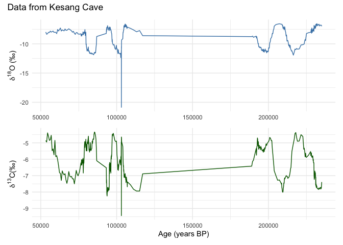

# Introduction

This document/binder is intended to act as a sandbox for new neotoma2 functions for SISAL.

We can work from a locally deployed API or from the development branch as of now.


``` r
# Setting the working environment. When the data is in production, this step can be ommitted.
Sys.setenv(APIPOINT = "https://str99atgzk.us-east-2.awsapprunner.com/v2.0/")
```

## Searching one cave

``` r
kesang <- tryCatch({
  neotoma2::get_sites(sitename = "%Kesang Cave%")
}, error = function(e) {
  readRDS("data/kesang.RDS")
})
plotLeaflet(kesang)
```

```{=html}
<div class="leaflet html-widget html-fill-item" id="htmlwidget-1f46176aa99c26dcbc43" style="width:672px;height:480px;"></div>
<script type="application/json" data-for="htmlwidget-1f46176aa99c26dcbc43">{"x":{"options":{"crs":{"crsClass":"L.CRS.EPSG3857","code":null,"proj4def":null,"projectedBounds":null,"options":{}}},"calls":[{"method":"addTiles","args":["https://{s}.tile.openstreetmap.org/{z}/{x}/{y}.png",null,null,{"minZoom":0,"maxZoom":18,"tileSize":256,"subdomains":"abc","errorTileUrl":"","tms":false,"noWrap":false,"zoomOffset":0,"zoomReverse":false,"opacity":1,"zIndex":1,"detectRetina":false,"attribution":"&copy; <a href=\"https://openstreetmap.org/copyright/\">OpenStreetMap<\/a>,  <a href=\"https://opendatacommons.org/licenses/odbl/\">ODbL<\/a>"}]},{"method":"addCircleMarkers","args":[42.87,81.75,10,null,null,{"interactive":true,"draggable":false,"keyboard":true,"title":"","alt":"","zIndexOffset":0,"opacity":1,"riseOnHover":true,"riseOffset":250,"stroke":true,"color":"#03F","weight":5,"opacity.1":0.5,"fill":true,"fillColor":"#03F","fillOpacity":0.2},{"showCoverageOnHover":true,"zoomToBoundsOnClick":true,"spiderfyOnMaxZoom":true,"removeOutsideVisibleBounds":true,"spiderLegPolylineOptions":{"weight":1.5,"color":"#222","opacity":0.5},"freezeAtZoom":false},null,"<b>Kesang Cave<\/b><br><b>Description:<\/b> NA<br><a href=http://apps.neotomadb.org/explorer/?siteids=37302>Explorer Link<\/a>",null,null,{"interactive":false,"permanent":false,"direction":"auto","opacity":1,"offset":[0,0],"textsize":"10px","textOnly":false,"className":"","sticky":true},null]}],"limits":{"lat":[42.87,42.87],"lng":[81.75,81.75]}},"evals":[],"jsHooks":[]}</script>
```

## Summary of Cave


``` r
neotoma2::summary(kesang)
```

```
##    siteid    sitename collectionunit chronologies datasets          types
## 1   37302 Kesang Cave        2-CNKS2            0        1     speleothem
## 2   37302 Kesang Cave        2-CNKS2            0        1 geochronologic
## 3   37302 Kesang Cave        2-CNKS3            0        1     speleothem
## 4   37302 Kesang Cave        2-CNKS3            0        1 geochronologic
## 5   37302 Kesang Cave        2-CNKS7            0        1     speleothem
## 6   37302 Kesang Cave        2-CNKS7            0        1 geochronologic
## 7   37302 Kesang Cave        2-CNKS9            0        1     speleothem
## 8   37302 Kesang Cave        2-CNKS9            0        1 geochronologic
## 9   37302 Kesang Cave        2-KS06A            0        1     speleothem
## 10  37302 Kesang Cave        2-KS06A            0        1 geochronologic
## 11  37302 Kesang Cave       2-KS06AH            0        1     speleothem
## 12  37302 Kesang Cave       2-KS06AH            0        1 geochronologic
## 13  37302 Kesang Cave        2-KS06B            0        1     speleothem
## 14  37302 Kesang Cave        2-KS06B            0        1 geochronologic
## 15  37302 Kesang Cave        2-KS081            0        1     speleothem
## 16  37302 Kesang Cave        2-KS081            0        1 geochronologic
## 17  37302 Kesang Cave       2-KS081H            0        1     speleothem
## 18  37302 Kesang Cave       2-KS081H            0        1 geochronologic
## 19  37302 Kesang Cave        2-KS082            0        1     speleothem
## 20  37302 Kesang Cave        2-KS082            0        1 geochronologic
## 21  37302 Kesang Cave       2-KS082H            0        1     speleothem
## 22  37302 Kesang Cave       2-KS082H            0        1 geochronologic
## 23  37302 Kesang Cave     2-KS082MIS            0        1     speleothem
## 24  37302 Kesang Cave     2-KS082MIS            0        1 geochronologic
## 25  37302 Kesang Cave        2-KS086            0        1     speleothem
## 26  37302 Kesang Cave        2-KS086            0        1 geochronologic
```


``` r
kesang_dl <- tryCatch({
  kesang %>% 
    neotoma2::filter(datasettype=="speleothem") %>% 
    neotoma2::get_downloads()
}, error = function(e) {
  readRDS("data/kesang_dl.RDS")
})
kesang_dl
```

```
##  siteid    sitename   lat  long altitude
##   37302 Kesang Cave 42.87 81.75     2000
```

## Getting the Speleothem Data
### `get_speleothems()`

``` r
kesang_sp <- tryCatch({
  neotoma2::get_speleothems(kesang_dl)
}, error = function(e) {
  readRDS("data/kesang_sp.RDS")
})
kesang_sp
```

```
##  siteid    sitename   lat  long altitude
##   37302 Kesang Cave 42.87 81.75     2000
```

### `speleothems` slot is in `collunits` slot.


``` r
kesang_sp[[1]]@collunits[[2]]@speleothems[[1]]
```

```
##  entityid entityname siteid collectionunitid dripheight monitoring   geology
##        13     KS06-B  37302            49537         NA      FALSE Limestone
##  relativeage speleothemtype dripheightunits entitycovertype entrancedistance
##  Pleistocene     stalagmite               m            <NA>               NA
##                    landusecovertype speleothemdriptype landusecoverpercent
##  Mixed Broadleaf/Needleleaf Forests            unknown                  NA
##  vegetationcovertype entitycoverthickness entrancedistanceunits
##               sparse                   NA                  <NA>
##  vegetationcoverpercent
##                      NA
```
### Displaying Speleothem MetaData `speleothems()`

``` r
neotoma2::speleothems(kesang_sp)
```

```
##    collunitid entityid  entityname speleothemtype speleothemdriptype dripheight
## 1       49511       12      KS06-A     stalagmite            unknown         NA
## 2       49537       13      KS06-B     stalagmite            unknown         NA
## 3       49552       11    KS06-A-H     stalagmite            unknown         NA
## 4       49591       14    KS08-1-H     stalagmite            unknown         NA
## 5       49622       15      KS08-1     stalagmite            unknown         NA
## 6       49633       17      KS08-2     stalagmite            unknown         NA
## 7       49660       16    KS08-2-H     stalagmite            unknown         NA
## 8       50362      622      CNKS-7     stalagmite            unknown         NA
## 9       50377      623      CNKS-9     stalagmite            unknown         NA
## 10      50411      621      CNKS-3     stalagmite            unknown         NA
## 11      50431      620      CNKS-2     stalagmite            unknown         NA
## 12      50828       18 KS08-2-MIS3     stalagmite            unknown         NA
## 13      50853       19      KS08-6     stalagmite            unknown         NA
##    dripheightunits monitoring   geology relativeage covertype
## 1                m      FALSE Limestone Pleistocene      <NA>
## 2                m      FALSE Limestone Pleistocene      <NA>
## 3                m      FALSE Limestone Pleistocene      <NA>
## 4                m      FALSE Limestone Pleistocene      <NA>
## 5                m      FALSE Limestone Pleistocene      <NA>
## 6                m      FALSE Limestone Pleistocene      <NA>
## 7                m      FALSE Limestone Pleistocene      <NA>
## 8                m      FALSE Limestone Pleistocene      <NA>
## 9                m      FALSE Limestone Pleistocene      <NA>
## 10               m      FALSE Limestone Pleistocene      <NA>
## 11               m      FALSE Limestone Pleistocene      <NA>
## 12               m      FALSE Limestone Pleistocene      <NA>
## 13               m      FALSE Limestone Pleistocene      <NA>
##    entitycoverthickness entrancedistance entrancedistanceunits
## 1                    NA               NA                  <NA>
## 2                    NA               NA                  <NA>
## 3                    NA               NA                  <NA>
## 4                    NA               NA                  <NA>
## 5                    NA               NA                  <NA>
## 6                    NA               NA                  <NA>
## 7                    NA               NA                  <NA>
## 8                    NA               NA                  <NA>
## 9                    NA               NA                  <NA>
## 10                   NA               NA                  <NA>
## 11                   NA               NA                  <NA>
## 12                   NA               NA                  <NA>
## 13                   NA               NA                  <NA>
##                      landusecovertype landusecoverpercent vegetationcovertype
## 1  Mixed Broadleaf/Needleleaf Forests                  NA              sparse
## 2  Mixed Broadleaf/Needleleaf Forests                  NA              sparse
## 3  Mixed Broadleaf/Needleleaf Forests                  NA              sparse
## 4  Mixed Broadleaf/Needleleaf Forests                  NA              sparse
## 5  Mixed Broadleaf/Needleleaf Forests                  NA              sparse
## 6  Mixed Broadleaf/Needleleaf Forests                  NA              sparse
## 7  Mixed Broadleaf/Needleleaf Forests                  NA              sparse
## 8  Mixed Broadleaf/Needleleaf Forests                  NA              sparse
## 9  Mixed Broadleaf/Needleleaf Forests                  NA              sparse
## 10 Mixed Broadleaf/Needleleaf Forests                  NA              sparse
## 11 Mixed Broadleaf/Needleleaf Forests                  NA              sparse
## 12 Mixed Broadleaf/Needleleaf Forests                  NA              sparse
## 13 Mixed Broadleaf/Needleleaf Forests                  NA              sparse
##    vegetationcoverpercent datasetid siteid    sitename   lat  long area
## 1                      NA     66789  37302 Kesang Cave 42.87 81.75   NA
## 2                      NA     66837  37302 Kesang Cave 42.87 81.75   NA
## 3                      NA     66867  37302 Kesang Cave 42.87 81.75   NA
## 4                      NA     66945  37302 Kesang Cave 42.87 81.75   NA
## 5                      NA     66997  37302 Kesang Cave 42.87 81.75   NA
## 6                      NA     67019  37302 Kesang Cave 42.87 81.75   NA
## 7                      NA     67073  37302 Kesang Cave 42.87 81.75   NA
## 8                      NA     68410  37302 Kesang Cave 42.87 81.75   NA
## 9                      NA     68440  37302 Kesang Cave 42.87 81.75   NA
## 10                     NA     68512  37302 Kesang Cave 42.87 81.75   NA
## 11                     NA     68552  37302 Kesang Cave 42.87 81.75   NA
## 12                     NA     69368  37302 Kesang Cave 42.87 81.75   NA
## 13                     NA     69416  37302 Kesang Cave 42.87 81.75   NA
##    sitenotes description elev
## 1       <NA>        <NA> 2000
## 2       <NA>        <NA> 2000
## 3       <NA>        <NA> 2000
## 4       <NA>        <NA> 2000
## 5       <NA>        <NA> 2000
## 6       <NA>        <NA> 2000
## 7       <NA>        <NA> 2000
## 8       <NA>        <NA> 2000
## 9       <NA>        <NA> 2000
## 10      <NA>        <NA> 2000
## 11      <NA>        <NA> 2000
## 12      <NA>        <NA> 2000
## 13      <NA>        <NA> 2000
```


### Displaying sample/speleothem data `speleothem_details()`

``` r
data <- tryCatch({
  neotoma2::speleothemdetails(kesang_sp)
}, error = function(e) {
  read.csv("data/kesang_data.csv")
})

head(data)
```

```
##        age age_range_old age_range_young age_units ageolder
## 1 53270.21      235118.5        53270.21      <NA>       NA
## 2 53270.21      235118.5        53270.21      <NA>       NA
## 3 53873.49      235118.5        53270.21      <NA>       NA
## 4 53873.49      235118.5        53270.21      <NA>       NA
## 5 53873.49      235118.5        53270.21      <NA>       NA
## 6 53873.49      235118.5        53270.21      <NA>       NA
##                           agetype ageyounger analysisunitid area chronologyid
## 1 Calibrated radiocarbon years BP         NA         737435   NA        51540
## 2 Calibrated radiocarbon years BP         NA         737435   NA        51540
## 3 Calibrated radiocarbon years BP         NA         737436   NA        51540
## 4 Calibrated radiocarbon years BP         NA         737436   NA        51540
## 5 Calibrated radiocarbon years BP         NA         737436   NA        51540
## 6 Calibrated radiocarbon years BP         NA         737436   NA        51540
##   chronologyname collunitid.x collunitid.y context covertype database datasetid
## 1         interp        49511        49511      NA      <NA>    SISAL     66789
## 2         interp        49511        49511      NA      <NA>    SISAL     66789
## 3         interp        49511        49511      NA      <NA>    SISAL     66789
## 4         interp        49511        49511      NA      <NA>    SISAL     66789
## 5         interp        49511        49511      NA      <NA>    SISAL     66789
## 6         interp        49511        49511      NA      <NA>    SISAL     66789
##   datasetnotes datasettype depth description dripheight dripheightunits
## 1         <NA>  speleothem  0.25        <NA>         NA               m
## 2         <NA>  speleothem  0.25        <NA>         NA               m
## 3         <NA>  speleothem  0.30        <NA>         NA               m
## 4         <NA>  speleothem  0.30        <NA>         NA               m
## 5         <NA>  speleothem  0.30        <NA>         NA               m
## 6         <NA>  speleothem  0.30        <NA>         NA               m
##   ecologicalgroup element elementtype elev entitycoverthickness entityid
## 1            ITOP      NA          NA 2000                   NA       12
## 2            ITOP      NA          NA 2000                   NA       12
## 3            <NA>      NA          NA 2000                   NA       12
## 4            <NA>      NA          NA 2000                   NA       12
## 5            ITOP      NA          NA 2000                   NA       12
## 6            ITOP      NA          NA 2000                   NA       12
##   entityname entrancedistance entrancedistanceunits   geology
## 1     KS06-A               NA                  <NA> Limestone
## 2     KS06-A               NA                  <NA> Limestone
## 3     KS06-A               NA                  <NA> Limestone
## 4     KS06-A               NA                  <NA> Limestone
## 5     KS06-A               NA                  <NA> Limestone
## 6     KS06-A               NA                  <NA> Limestone
##   landusecoverpercent                   landusecovertype   lat  long monitoring
## 1                  NA Mixed Broadleaf/Needleleaf Forests 42.87 81.75      FALSE
## 2                  NA Mixed Broadleaf/Needleleaf Forests 42.87 81.75      FALSE
## 3                  NA Mixed Broadleaf/Needleleaf Forests 42.87 81.75      FALSE
## 4                  NA Mixed Broadleaf/Needleleaf Forests 42.87 81.75      FALSE
## 5                  NA Mixed Broadleaf/Needleleaf Forests 42.87 81.75      FALSE
## 6                  NA Mixed Broadleaf/Needleleaf Forests 42.87 81.75      FALSE
##   recdatecreated relativeage sampleanalyst sampleid samplename siteid
## 1           <NA> Pleistocene                 893088       4956  37302
## 2           <NA> Pleistocene                 893088       4956  37302
## 3           <NA> Pleistocene                 893089       4957  37302
## 4           <NA> Pleistocene                 893089       4957  37302
## 5           <NA> Pleistocene                 893089       4957  37302
## 6           <NA> Pleistocene                 893089       4957  37302
##      sitename sitenotes speleothemdriptype speleothemtype symmetry
## 1 Kesang Cave      <NA>            unknown     stalagmite       NA
## 2 Kesang Cave      <NA>            unknown     stalagmite       NA
## 3 Kesang Cave      <NA>            unknown     stalagmite       NA
## 4 Kesang Cave      <NA>            unknown     stalagmite       NA
## 5 Kesang Cave      <NA>            unknown     stalagmite       NA
## 6 Kesang Cave      <NA>            unknown     stalagmite       NA
##           taxongroup taxonid thickness     units   value variablename
## 1    Stable isotopes   27853        NA per mille   -7.98         δ18O
## 2    Stable isotopes   27851        NA per mille   -4.86         δ13C
## 3 Chemical substance   53019        NA      <NA> 3072.00         238U
## 4 Chemical substance   53018        NA      <NA> 3290.00        232Th
## 5    Stable isotopes   27853        NA per mille   -8.36         δ18O
## 6    Stable isotopes   27851        NA per mille   -4.95         δ13C
##   vegetationcoverpercent vegetationcovertype
## 1                     NA              sparse
## 2                     NA              sparse
## 3                     NA              sparse
## 4                     NA              sparse
## 5                     NA              sparse
## 6                     NA              sparse
```

## Taxa in Kesang

``` r
head(taxa(kesang_sp))
```

```
## # A tibble: 6 × 11
## # Groups:   units, context, element, taxonid, symmetry, taxongroup,
## #   elementtype, variablename, ecologicalgroup [6]
##   units     context element taxonid symmetry taxongroup elementtype variablename
##   <chr>     <lgl>   <lgl>     <int> <lgl>    <chr>      <lgl>       <chr>       
## 1 mmol/mol  NA      NA        52899 NA       Chemical … NA          Strontium:C…
## 2 mmol/mol  NA      NA        52900 NA       Chemical … NA          Magnesium:C…
## 3 mmol/mol  NA      NA        52901 NA       Chemical … NA          Barium:Calc…
## 4 mmol/mol  NA      NA        52903 NA       Chemical … NA          Uranium:Cal…
## 5 per mille NA      NA        27851 NA       Stable is… NA          δ13C        
## 6 per mille NA      NA        27853 NA       Stable is… NA          δ18O        
## # ℹ 3 more variables: ecologicalgroup <chr>, samples <int>, sites <int>
```

### Ordering the data in wide format `toWide()`


``` r
values <- kesang_sp[[1]]@collunits[[1]] %>%
  samples() %>%
  toWide(ecologicalgroup = c("ITOP"),
         unit = c("per mille"),
         groupby = "age",
         elementtype = NA,
         operation = "sum") %>%
  arrange(age) %>% na.omit()

values %>% 
  head() %>% 
  flextable() %>% 
  fontsize(size = 8, part = "all") %>%
  autofit() 
```

```{=html}
<div class="tabwid"><style>.cl-fdb5ce8e{}.cl-fdb385ac{font-family:'Helvetica';font-size:8pt;font-weight:normal;font-style:normal;text-decoration:none;color:rgba(0, 0, 0, 1.00);background-color:transparent;}.cl-fdb468c8{margin:0;text-align:right;border-bottom: 0 solid rgba(0, 0, 0, 1.00);border-top: 0 solid rgba(0, 0, 0, 1.00);border-left: 0 solid rgba(0, 0, 0, 1.00);border-right: 0 solid rgba(0, 0, 0, 1.00);padding-bottom:5pt;padding-top:5pt;padding-left:5pt;padding-right:5pt;line-height: 1;background-color:transparent;}.cl-fdb47336{width:0.779in;background-color:transparent;vertical-align: middle;border-bottom: 1.5pt solid rgba(102, 102, 102, 1.00);border-top: 1.5pt solid rgba(102, 102, 102, 1.00);border-left: 0 solid rgba(0, 0, 0, 1.00);border-right: 0 solid rgba(0, 0, 0, 1.00);margin-bottom:0;margin-top:0;margin-left:0;margin-right:0;}.cl-fdb47337{width:0.563in;background-color:transparent;vertical-align: middle;border-bottom: 1.5pt solid rgba(102, 102, 102, 1.00);border-top: 1.5pt solid rgba(102, 102, 102, 1.00);border-left: 0 solid rgba(0, 0, 0, 1.00);border-right: 0 solid rgba(0, 0, 0, 1.00);margin-bottom:0;margin-top:0;margin-left:0;margin-right:0;}.cl-fdb47338{width:0.557in;background-color:transparent;vertical-align: middle;border-bottom: 1.5pt solid rgba(102, 102, 102, 1.00);border-top: 1.5pt solid rgba(102, 102, 102, 1.00);border-left: 0 solid rgba(0, 0, 0, 1.00);border-right: 0 solid rgba(0, 0, 0, 1.00);margin-bottom:0;margin-top:0;margin-left:0;margin-right:0;}.cl-fdb47340{width:0.779in;background-color:transparent;vertical-align: middle;border-bottom: 0 solid rgba(0, 0, 0, 1.00);border-top: 0 solid rgba(0, 0, 0, 1.00);border-left: 0 solid rgba(0, 0, 0, 1.00);border-right: 0 solid rgba(0, 0, 0, 1.00);margin-bottom:0;margin-top:0;margin-left:0;margin-right:0;}.cl-fdb47341{width:0.563in;background-color:transparent;vertical-align: middle;border-bottom: 0 solid rgba(0, 0, 0, 1.00);border-top: 0 solid rgba(0, 0, 0, 1.00);border-left: 0 solid rgba(0, 0, 0, 1.00);border-right: 0 solid rgba(0, 0, 0, 1.00);margin-bottom:0;margin-top:0;margin-left:0;margin-right:0;}.cl-fdb47342{width:0.557in;background-color:transparent;vertical-align: middle;border-bottom: 0 solid rgba(0, 0, 0, 1.00);border-top: 0 solid rgba(0, 0, 0, 1.00);border-left: 0 solid rgba(0, 0, 0, 1.00);border-right: 0 solid rgba(0, 0, 0, 1.00);margin-bottom:0;margin-top:0;margin-left:0;margin-right:0;}.cl-fdb4734a{width:0.779in;background-color:transparent;vertical-align: middle;border-bottom: 0 solid rgba(0, 0, 0, 1.00);border-top: 0 solid rgba(0, 0, 0, 1.00);border-left: 0 solid rgba(0, 0, 0, 1.00);border-right: 0 solid rgba(0, 0, 0, 1.00);margin-bottom:0;margin-top:0;margin-left:0;margin-right:0;}.cl-fdb4734b{width:0.563in;background-color:transparent;vertical-align: middle;border-bottom: 0 solid rgba(0, 0, 0, 1.00);border-top: 0 solid rgba(0, 0, 0, 1.00);border-left: 0 solid rgba(0, 0, 0, 1.00);border-right: 0 solid rgba(0, 0, 0, 1.00);margin-bottom:0;margin-top:0;margin-left:0;margin-right:0;}.cl-fdb4734c{width:0.557in;background-color:transparent;vertical-align: middle;border-bottom: 0 solid rgba(0, 0, 0, 1.00);border-top: 0 solid rgba(0, 0, 0, 1.00);border-left: 0 solid rgba(0, 0, 0, 1.00);border-right: 0 solid rgba(0, 0, 0, 1.00);margin-bottom:0;margin-top:0;margin-left:0;margin-right:0;}.cl-fdb4734d{width:0.779in;background-color:transparent;vertical-align: middle;border-bottom: 0 solid rgba(0, 0, 0, 1.00);border-top: 0 solid rgba(0, 0, 0, 1.00);border-left: 0 solid rgba(0, 0, 0, 1.00);border-right: 0 solid rgba(0, 0, 0, 1.00);margin-bottom:0;margin-top:0;margin-left:0;margin-right:0;}.cl-fdb47354{width:0.563in;background-color:transparent;vertical-align: middle;border-bottom: 0 solid rgba(0, 0, 0, 1.00);border-top: 0 solid rgba(0, 0, 0, 1.00);border-left: 0 solid rgba(0, 0, 0, 1.00);border-right: 0 solid rgba(0, 0, 0, 1.00);margin-bottom:0;margin-top:0;margin-left:0;margin-right:0;}.cl-fdb47355{width:0.557in;background-color:transparent;vertical-align: middle;border-bottom: 0 solid rgba(0, 0, 0, 1.00);border-top: 0 solid rgba(0, 0, 0, 1.00);border-left: 0 solid rgba(0, 0, 0, 1.00);border-right: 0 solid rgba(0, 0, 0, 1.00);margin-bottom:0;margin-top:0;margin-left:0;margin-right:0;}.cl-fdb47356{width:0.779in;background-color:transparent;vertical-align: middle;border-bottom: 1.5pt solid rgba(102, 102, 102, 1.00);border-top: 0 solid rgba(0, 0, 0, 1.00);border-left: 0 solid rgba(0, 0, 0, 1.00);border-right: 0 solid rgba(0, 0, 0, 1.00);margin-bottom:0;margin-top:0;margin-left:0;margin-right:0;}.cl-fdb47357{width:0.563in;background-color:transparent;vertical-align: middle;border-bottom: 1.5pt solid rgba(102, 102, 102, 1.00);border-top: 0 solid rgba(0, 0, 0, 1.00);border-left: 0 solid rgba(0, 0, 0, 1.00);border-right: 0 solid rgba(0, 0, 0, 1.00);margin-bottom:0;margin-top:0;margin-left:0;margin-right:0;}.cl-fdb47358{width:0.557in;background-color:transparent;vertical-align: middle;border-bottom: 1.5pt solid rgba(102, 102, 102, 1.00);border-top: 0 solid rgba(0, 0, 0, 1.00);border-left: 0 solid rgba(0, 0, 0, 1.00);border-right: 0 solid rgba(0, 0, 0, 1.00);margin-bottom:0;margin-top:0;margin-left:0;margin-right:0;}</style><table data-quarto-disable-processing='true' class='cl-fdb5ce8e'><thead><tr style="overflow-wrap:break-word;"><th class="cl-fdb47336"><p class="cl-fdb468c8"><span class="cl-fdb385ac">age</span></p></th><th class="cl-fdb47337"><p class="cl-fdb468c8"><span class="cl-fdb385ac">δ18O</span></p></th><th class="cl-fdb47338"><p class="cl-fdb468c8"><span class="cl-fdb385ac">δ13C</span></p></th></tr></thead><tbody><tr style="overflow-wrap:break-word;"><td class="cl-fdb47340"><p class="cl-fdb468c8"><span class="cl-fdb385ac">53,270.21</span></p></td><td class="cl-fdb47341"><p class="cl-fdb468c8"><span class="cl-fdb385ac">-7.98</span></p></td><td class="cl-fdb47342"><p class="cl-fdb468c8"><span class="cl-fdb385ac">-4.86</span></p></td></tr><tr style="overflow-wrap:break-word;"><td class="cl-fdb4734a"><p class="cl-fdb468c8"><span class="cl-fdb385ac">53,873.49</span></p></td><td class="cl-fdb4734b"><p class="cl-fdb468c8"><span class="cl-fdb385ac">-8.36</span></p></td><td class="cl-fdb4734c"><p class="cl-fdb468c8"><span class="cl-fdb385ac">-4.95</span></p></td></tr><tr style="overflow-wrap:break-word;"><td class="cl-fdb4734d"><p class="cl-fdb468c8"><span class="cl-fdb385ac">54,476.76</span></p></td><td class="cl-fdb47354"><p class="cl-fdb468c8"><span class="cl-fdb385ac">-8.25</span></p></td><td class="cl-fdb47355"><p class="cl-fdb468c8"><span class="cl-fdb385ac">-4.39</span></p></td></tr><tr style="overflow-wrap:break-word;"><td class="cl-fdb4734a"><p class="cl-fdb468c8"><span class="cl-fdb385ac">55,080.03</span></p></td><td class="cl-fdb4734b"><p class="cl-fdb468c8"><span class="cl-fdb385ac">-8.02</span></p></td><td class="cl-fdb4734c"><p class="cl-fdb468c8"><span class="cl-fdb385ac">-4.60</span></p></td></tr><tr style="overflow-wrap:break-word;"><td class="cl-fdb4734d"><p class="cl-fdb468c8"><span class="cl-fdb385ac">55,683.30</span></p></td><td class="cl-fdb47354"><p class="cl-fdb468c8"><span class="cl-fdb385ac">-8.06</span></p></td><td class="cl-fdb47355"><p class="cl-fdb468c8"><span class="cl-fdb385ac">-4.85</span></p></td></tr><tr style="overflow-wrap:break-word;"><td class="cl-fdb47356"><p class="cl-fdb468c8"><span class="cl-fdb385ac">56,286.57</span></p></td><td class="cl-fdb47357"><p class="cl-fdb468c8"><span class="cl-fdb385ac">-7.82</span></p></td><td class="cl-fdb47358"><p class="cl-fdb468c8"><span class="cl-fdb385ac">-4.81</span></p></td></tr></tbody></table></div>
```


``` r
# Make sure age is in descending order (younger to older)
values <- values %>% arrange(desc(age))
head(values)
```

```
## # A tibble: 6 × 3
##       age  δ18O  δ13C
##     <dbl> <dbl> <dbl>
## 1 235119. -6.99 -7.39
## 2 234854. -6.81 -7.75
## 3 234589. -6.8  -7.81
## 4 234324. -6.81 -7.71
## 5 234060. -6.79 -7.74
## 6 233795. -6.94 -7.82
```


``` r
# d18O plot (top)
p1 <- ggplot(values, aes(x = age, y = δ18O)) +
  geom_line(color = "steelblue") +
  #scale_x_reverse() +
  theme_minimal() +
  labs(y = expression(delta^{18}*O*" ("*"\u2030"*")"), x = NULL)

# d13C plot (bottom)
p2 <- ggplot(values, aes(x = age, y = δ13C)) +
  geom_line(color = "darkgreen") +
  #scale_x_reverse() +
  theme_minimal() +
  labs(y = expression(delta^{13}*C* "("*"\u2030"*")"), x = "Age (years BP)")

# Combine the two plots and add a title
(p1 / p2) + plot_annotation(title = paste('Data from',kesang_sp[[1]]$sitename))
```


