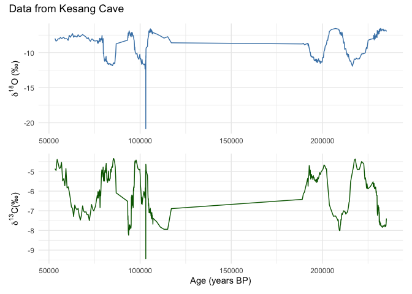

# Introduction

This document/binder is intended to act as a sandbox for new neotoma2 functions for SISAL.

We can work from a locally deployed API or from the development branch as of now.


``` r
# Setting the working environment. When the data is in production, this step can be ommitted.
Sys.setenv(APIPOINT = "https://api-dev.neotomadb.org/v2.0/")
```

## Searching one cave

``` r
kesang <- tryCatch({
  neotoma2::get_sites(sitename = "%Kesang Cave%")
}, error = function(e) {
  NULL
})
plotLeaflet(kesang)
```

```{=html}
<div class="leaflet html-widget html-fill-item" id="htmlwidget-6b4f14fa9097965ddeaf" style="width:672px;height:480px;"></div>
<script type="application/json" data-for="htmlwidget-6b4f14fa9097965ddeaf">{"x":{"options":{"crs":{"crsClass":"L.CRS.EPSG3857","code":null,"proj4def":null,"projectedBounds":null,"options":{}}},"calls":[{"method":"addTiles","args":["https://{s}.tile.openstreetmap.org/{z}/{x}/{y}.png",null,null,{"minZoom":0,"maxZoom":18,"tileSize":256,"subdomains":"abc","errorTileUrl":"","tms":false,"noWrap":false,"zoomOffset":0,"zoomReverse":false,"opacity":1,"zIndex":1,"detectRetina":false,"attribution":"&copy; <a href=\"https://openstreetmap.org/copyright/\">OpenStreetMap<\/a>,  <a href=\"https://opendatacommons.org/licenses/odbl/\">ODbL<\/a>"}]},{"method":"addCircleMarkers","args":[42.87,81.75,10,null,null,{"interactive":true,"draggable":false,"keyboard":true,"title":"","alt":"","zIndexOffset":0,"opacity":1,"riseOnHover":true,"riseOffset":250,"stroke":true,"color":"#03F","weight":5,"opacity.1":0.5,"fill":true,"fillColor":"#03F","fillOpacity":0.2},{"showCoverageOnHover":true,"zoomToBoundsOnClick":true,"spiderfyOnMaxZoom":true,"removeOutsideVisibleBounds":true,"spiderLegPolylineOptions":{"weight":1.5,"color":"#222","opacity":0.5},"freezeAtZoom":false},null,"<b>Kesang Cave<\/b><br><b>Description:<\/b> NA<br><a href=http://apps.neotomadb.org/explorer/?siteids=37302>Explorer Link<\/a>",null,null,{"interactive":false,"permanent":false,"direction":"auto","opacity":1,"offset":[0,0],"textsize":"10px","textOnly":false,"className":"","sticky":true},null]}],"limits":{"lat":[42.87,42.87],"lng":[81.75,81.75]}},"evals":[],"jsHooks":[]}</script>
```

## Summary of Cave


``` r
neotoma2::getids(kesang)
```

```
##    siteid collunitid datasetid
## 1   37302      49511     66789
## 2   37302      49511     66790
## 3   37302      49537     66837
## 4   37302      49537     66838
## 5   37302      49552     66867
## 6   37302      49552     66868
## 7   37302      49591     66945
## 8   37302      49591     66946
## 9   37302      49622     66997
## 10  37302      49622     66998
## 11  37302      49633     67019
## 12  37302      49633     67020
## 13  37302      49660     67073
## 14  37302      49660     67074
## 15  37302      50362     68410
## 16  37302      50362     68411
## 17  37302      50377     68440
## 18  37302      50377     68441
## 19  37302      50411     68512
## 20  37302      50411     68513
## 21  37302      50431     68552
## 22  37302      50431     68553
## 23  37302      50828     69368
## 24  37302      50828     69369
## 25  37302      50853     69416
## 26  37302      50853     69417
```


``` r
kesang_dl <- tryCatch({
  kesang %>% 
    neotoma2::filter(datasettype=="speleothem") %>% 
    neotoma2::get_downloads()
}, error = function(e) {
  readRDS("data/kesang_dl.RDS")
})
kesang_dl
```

```
## $`37302`
##  siteid    sitename   lat  long area notes description elev
##   37302 Kesang Cave 42.87 81.75   NA  <NA>        <NA> 2000
```

## Getting the Speleothem Data
### `get_speleothems()`

``` r
kesang_sp <- tryCatch({
  neotoma2::get_speleothems(kesang_dl)
}, error = function(e) {
  readRDS("data/kesang_sp.RDS")
})
kesang_sp
```

```
## $`37302`
##  siteid    sitename   lat  long area notes description elev
##   37302 Kesang Cave 42.87 81.75   NA  <NA>        <NA> 2000
```

### `speleothems` slot is in `collunits` slot.


``` r
kesang_sp[[1]]@collunits[[2]]@speleothems[[1]]
```

```
##  entityid entityname siteid collectionunitid speleothemdriptype dripheight
##        13     KS06-B  37302            49537            unknown         NA
##  dripheightunits monitoring   geology relativeage speleothemtype
##                m      FALSE Limestone Pleistocene     stalagmite
##  entrancedistance entrancedistanceunits                   landusecovertype
##                NA                     m Mixed Broadleaf/Needleleaf Forests
##  landusecoverpercent vegetationcovertype vegetationcoverpercent entitycovertype
##                   NA              sparse                     NA            <NA>
##  entitycoverthickness
##                    NA
```
### Displaying Speleothem MetaData `speleothems()`

``` r
neotoma2::speleothems(kesang_sp)
```

```
## [1] "got here"
##   collectionunitid datasetid
## 1            49511     66789
## [1] "got here"
##   collectionunitid datasetid
## 1            49537     66837
## [1] "got here"
##   collectionunitid datasetid
## 1            49552     66867
## [1] "got here"
##   collectionunitid datasetid
## 1            49591     66945
## [1] "got here"
##   collectionunitid datasetid
## 1            49622     66997
## [1] "got here"
##   collectionunitid datasetid
## 1            49633     67019
## [1] "got here"
##   collectionunitid datasetid
## 1            49660     67073
## [1] "got here"
##   collectionunitid datasetid
## 1            50362     68410
## [1] "got here"
##   collectionunitid datasetid
## 1            50377     68440
## [1] "got here"
##   collectionunitid datasetid
## 1            50411     68512
## [1] "got here"
##   collectionunitid datasetid
## 1            50431     68552
## [1] "got here"
##   collectionunitid datasetid
## 1            50828     69368
## [1] "got here"
##   collectionunitid datasetid
## 1            50853     69416
## [1] "output:"
##    siteid    sitename collectionunitid datasetid entityid  entityname
## 1   37302 Kesang Cave            49552     66867       11    KS06-A-H
## 2   37302 Kesang Cave            49511     66789       12      KS06-A
## 3   37302 Kesang Cave            49537     66837       13      KS06-B
## 4   37302 Kesang Cave            49591     66945       14    KS08-1-H
## 5   37302 Kesang Cave            49622     66997       15      KS08-1
## 6   37302 Kesang Cave            49660     67073       16    KS08-2-H
## 7   37302 Kesang Cave            49633     67019       17      KS08-2
## 8   37302 Kesang Cave            50828     69368       18 KS08-2-MIS3
## 9   37302 Kesang Cave            50853     69416       19      KS08-6
## 10  37302 Kesang Cave            50431     68552      620      CNKS-2
## 11  37302 Kesang Cave            50411     68512      621      CNKS-3
## 12  37302 Kesang Cave            50362     68410      622      CNKS-7
## 13  37302 Kesang Cave            50377     68440      623      CNKS-9
##    speleothemtype   geology relativeage monitoring speleothemdriptype
## 1      stalagmite Limestone Pleistocene      FALSE            unknown
## 2      stalagmite Limestone Pleistocene      FALSE            unknown
## 3      stalagmite Limestone Pleistocene      FALSE            unknown
## 4      stalagmite Limestone Pleistocene      FALSE            unknown
## 5      stalagmite Limestone Pleistocene      FALSE            unknown
## 6      stalagmite Limestone Pleistocene      FALSE            unknown
## 7      stalagmite Limestone Pleistocene      FALSE            unknown
## 8      stalagmite Limestone Pleistocene      FALSE            unknown
## 9      stalagmite Limestone Pleistocene      FALSE            unknown
## 10     stalagmite Limestone Pleistocene      FALSE            unknown
## 11     stalagmite Limestone Pleistocene      FALSE            unknown
## 12     stalagmite Limestone Pleistocene      FALSE            unknown
## 13     stalagmite Limestone Pleistocene      FALSE            unknown
##    dripheight dripheightunits covertype entitycoverthickness entrancedistance
## 1          NA               m      <NA>                   NA               NA
## 2          NA               m      <NA>                   NA               NA
## 3          NA               m      <NA>                   NA               NA
## 4          NA               m      <NA>                   NA               NA
## 5          NA               m      <NA>                   NA               NA
## 6          NA               m      <NA>                   NA               NA
## 7          NA               m      <NA>                   NA               NA
## 8          NA               m      <NA>                   NA               NA
## 9          NA               m      <NA>                   NA               NA
## 10         NA               m      <NA>                   NA               NA
## 11         NA               m      <NA>                   NA               NA
## 12         NA               m      <NA>                   NA               NA
## 13         NA               m      <NA>                   NA               NA
##    entrancedistanceunits                   landusecovertype landusecoverpercent
## 1                      m Mixed Broadleaf/Needleleaf Forests                  NA
## 2                      m Mixed Broadleaf/Needleleaf Forests                  NA
## 3                      m Mixed Broadleaf/Needleleaf Forests                  NA
## 4                      m Mixed Broadleaf/Needleleaf Forests                  NA
## 5                      m Mixed Broadleaf/Needleleaf Forests                  NA
## 6                      m Mixed Broadleaf/Needleleaf Forests                  NA
## 7                      m Mixed Broadleaf/Needleleaf Forests                  NA
## 8                      m Mixed Broadleaf/Needleleaf Forests                  NA
## 9                      m Mixed Broadleaf/Needleleaf Forests                  NA
## 10                     m Mixed Broadleaf/Needleleaf Forests                  NA
## 11                     m Mixed Broadleaf/Needleleaf Forests                  NA
## 12                     m Mixed Broadleaf/Needleleaf Forests                  NA
## 13                     m Mixed Broadleaf/Needleleaf Forests                  NA
##    vegetationcovertype vegetationcoverpercent
## 1               sparse                     NA
## 2               sparse                     NA
## 3               sparse                     NA
## 4               sparse                     NA
## 5               sparse                     NA
## 6               sparse                     NA
## 7               sparse                     NA
## 8               sparse                     NA
## 9               sparse                     NA
## 10              sparse                     NA
## 11              sparse                     NA
## 12              sparse                     NA
## 13              sparse                     NA
```

```
##    siteid    sitename collectionunitid datasetid entityid  entityname
## 1   37302 Kesang Cave            49552     66867       11    KS06-A-H
## 2   37302 Kesang Cave            49511     66789       12      KS06-A
## 3   37302 Kesang Cave            49537     66837       13      KS06-B
## 4   37302 Kesang Cave            49591     66945       14    KS08-1-H
## 5   37302 Kesang Cave            49622     66997       15      KS08-1
## 6   37302 Kesang Cave            49660     67073       16    KS08-2-H
## 7   37302 Kesang Cave            49633     67019       17      KS08-2
## 8   37302 Kesang Cave            50828     69368       18 KS08-2-MIS3
## 9   37302 Kesang Cave            50853     69416       19      KS08-6
## 10  37302 Kesang Cave            50431     68552      620      CNKS-2
## 11  37302 Kesang Cave            50411     68512      621      CNKS-3
## 12  37302 Kesang Cave            50362     68410      622      CNKS-7
## 13  37302 Kesang Cave            50377     68440      623      CNKS-9
##    speleothemtype   geology relativeage monitoring speleothemdriptype
## 1      stalagmite Limestone Pleistocene      FALSE            unknown
## 2      stalagmite Limestone Pleistocene      FALSE            unknown
## 3      stalagmite Limestone Pleistocene      FALSE            unknown
## 4      stalagmite Limestone Pleistocene      FALSE            unknown
## 5      stalagmite Limestone Pleistocene      FALSE            unknown
## 6      stalagmite Limestone Pleistocene      FALSE            unknown
## 7      stalagmite Limestone Pleistocene      FALSE            unknown
## 8      stalagmite Limestone Pleistocene      FALSE            unknown
## 9      stalagmite Limestone Pleistocene      FALSE            unknown
## 10     stalagmite Limestone Pleistocene      FALSE            unknown
## 11     stalagmite Limestone Pleistocene      FALSE            unknown
## 12     stalagmite Limestone Pleistocene      FALSE            unknown
## 13     stalagmite Limestone Pleistocene      FALSE            unknown
##    dripheight dripheightunits covertype entitycoverthickness entrancedistance
## 1          NA               m      <NA>                   NA               NA
## 2          NA               m      <NA>                   NA               NA
## 3          NA               m      <NA>                   NA               NA
## 4          NA               m      <NA>                   NA               NA
## 5          NA               m      <NA>                   NA               NA
## 6          NA               m      <NA>                   NA               NA
## 7          NA               m      <NA>                   NA               NA
## 8          NA               m      <NA>                   NA               NA
## 9          NA               m      <NA>                   NA               NA
## 10         NA               m      <NA>                   NA               NA
## 11         NA               m      <NA>                   NA               NA
## 12         NA               m      <NA>                   NA               NA
## 13         NA               m      <NA>                   NA               NA
##    entrancedistanceunits                   landusecovertype landusecoverpercent
## 1                      m Mixed Broadleaf/Needleleaf Forests                  NA
## 2                      m Mixed Broadleaf/Needleleaf Forests                  NA
## 3                      m Mixed Broadleaf/Needleleaf Forests                  NA
## 4                      m Mixed Broadleaf/Needleleaf Forests                  NA
## 5                      m Mixed Broadleaf/Needleleaf Forests                  NA
## 6                      m Mixed Broadleaf/Needleleaf Forests                  NA
## 7                      m Mixed Broadleaf/Needleleaf Forests                  NA
## 8                      m Mixed Broadleaf/Needleleaf Forests                  NA
## 9                      m Mixed Broadleaf/Needleleaf Forests                  NA
## 10                     m Mixed Broadleaf/Needleleaf Forests                  NA
## 11                     m Mixed Broadleaf/Needleleaf Forests                  NA
## 12                     m Mixed Broadleaf/Needleleaf Forests                  NA
## 13                     m Mixed Broadleaf/Needleleaf Forests                  NA
##    vegetationcovertype vegetationcoverpercent
## 1               sparse                     NA
## 2               sparse                     NA
## 3               sparse                     NA
## 4               sparse                     NA
## 5               sparse                     NA
## 6               sparse                     NA
## 7               sparse                     NA
## 8               sparse                     NA
## 9               sparse                     NA
## 10              sparse                     NA
## 11              sparse                     NA
## 12              sparse                     NA
## 13              sparse                     NA
```


### Displaying sample/speleothem data `speleothem_details()`

``` r
data <- tryCatch({
  neotoma2::speleothemdetails(kesang_sp)
}, error = function(e) {
  read.csv("data/kesang_data.csv")
})
```

```
## [1] "got here"
##   collectionunitid datasetid
## 1            49511     66789
## [1] "got here"
##   collectionunitid datasetid
## 1            49537     66837
## [1] "got here"
##   collectionunitid datasetid
## 1            49552     66867
## [1] "got here"
##   collectionunitid datasetid
## 1            49591     66945
## [1] "got here"
##   collectionunitid datasetid
## 1            49622     66997
## [1] "got here"
##   collectionunitid datasetid
## 1            49633     67019
## [1] "got here"
##   collectionunitid datasetid
## 1            49660     67073
## [1] "got here"
##   collectionunitid datasetid
## 1            50362     68410
## [1] "got here"
##   collectionunitid datasetid
## 1            50377     68440
## [1] "got here"
##   collectionunitid datasetid
## 1            50411     68512
## [1] "got here"
##   collectionunitid datasetid
## 1            50431     68552
## [1] "got here"
##   collectionunitid datasetid
## 1            50828     69368
## [1] "got here"
##   collectionunitid datasetid
## 1            50853     69416
```

``` r
head(data)
```

```
##   siteid    sitename collectionunitid datasetid entityid entityname depth
## 1  37302 Kesang Cave            49552     66867       11   KS06-A-H   0.0
## 2  37302 Kesang Cave            49552     66867       11   KS06-A-H   0.3
## 3  37302 Kesang Cave            49552     66867       11   KS06-A-H   0.5
## 4  37302 Kesang Cave            49552     66867       11   KS06-A-H   0.8
## 5  37302 Kesang Cave            49552     66867       11   KS06-A-H   1.0
## 6  37302 Kesang Cave            49552     66867       11   KS06-A-H   1.3
##   thickness chronologyid chronologyname                         agetype
## 1        NA        51625 lin_interp_age Calibrated radiocarbon years BP
## 2        NA        51625 lin_interp_age Calibrated radiocarbon years BP
## 3        NA        51625 lin_interp_age Calibrated radiocarbon years BP
## 4        NA        51625 lin_interp_age Calibrated radiocarbon years BP
## 5        NA        51625 lin_interp_age Calibrated radiocarbon years BP
## 6        NA        51625 lin_interp_age Calibrated radiocarbon years BP
##   ageolder  age ageyounger age_units sampleid samplename      taxongroup
## 1       NA 3570         NA      <NA>   919152       4822 Stable isotopes
## 2       NA 3610         NA      <NA>   919153       4823 Stable isotopes
## 3       NA 3650         NA      <NA>   919154       4824 Stable isotopes
## 4       NA 3680         NA      <NA>   919155       4825 Stable isotopes
## 5       NA 3720         NA      <NA>   919156       4826 Stable isotopes
## 6       NA 3760         NA      <NA>   919157       4827 Stable isotopes
##   ecologicalgroup taxonid variablename value     units speleothemtype   geology
## 1            ITOP   27851         δ13C -6.28 per mille     stalagmite Limestone
## 2            ITOP   27851         δ13C -7.50 per mille     stalagmite Limestone
## 3            ITOP   27851         δ13C -7.81 per mille     stalagmite Limestone
## 4            ITOP   27851         δ13C -7.59 per mille     stalagmite Limestone
## 5            ITOP   27851         δ13C -7.57 per mille     stalagmite Limestone
## 6            ITOP   27851         δ13C -7.14 per mille     stalagmite Limestone
##   relativeage monitoring speleothemdriptype dripheight dripheightunits
## 1 Pleistocene      FALSE            unknown         NA               m
## 2 Pleistocene      FALSE            unknown         NA               m
## 3 Pleistocene      FALSE            unknown         NA               m
## 4 Pleistocene      FALSE            unknown         NA               m
## 5 Pleistocene      FALSE            unknown         NA               m
## 6 Pleistocene      FALSE            unknown         NA               m
##   covertype entitycoverthickness entrancedistance entrancedistanceunits
## 1      <NA>                   NA               NA                     m
## 2      <NA>                   NA               NA                     m
## 3      <NA>                   NA               NA                     m
## 4      <NA>                   NA               NA                     m
## 5      <NA>                   NA               NA                     m
## 6      <NA>                   NA               NA                     m
##                     landusecovertype landusecoverpercent vegetationcovertype
## 1 Mixed Broadleaf/Needleleaf Forests                  NA              sparse
## 2 Mixed Broadleaf/Needleleaf Forests                  NA              sparse
## 3 Mixed Broadleaf/Needleleaf Forests                  NA              sparse
## 4 Mixed Broadleaf/Needleleaf Forests                  NA              sparse
## 5 Mixed Broadleaf/Needleleaf Forests                  NA              sparse
## 6 Mixed Broadleaf/Needleleaf Forests                  NA              sparse
##   vegetationcoverpercent
## 1                     NA
## 2                     NA
## 3                     NA
## 4                     NA
## 5                     NA
## 6                     NA
```

## Taxa in Kesang

``` r
head(taxa(kesang_sp))
```

```
## # A tibble: 6 × 11
## # Groups:   units, context, element, taxonid, symmetry, taxongroup,
## #   elementtype, variablename, ecologicalgroup [6]
##   units     context element taxonid symmetry taxongroup elementtype variablename
##   <chr>     <lgl>   <lgl>     <int> <lgl>    <chr>      <lgl>       <chr>       
## 1 mmol/mol  NA      NA        52899 NA       Chemical … NA          Strontium:C…
## 2 mmol/mol  NA      NA        52900 NA       Chemical … NA          Magnesium:C…
## 3 mmol/mol  NA      NA        52901 NA       Chemical … NA          Barium:Calc…
## 4 mmol/mol  NA      NA        52903 NA       Chemical … NA          Uranium:Cal…
## 5 per mille NA      NA        27851 NA       Stable is… NA          δ13C        
## 6 per mille NA      NA        27853 NA       Stable is… NA          δ18O        
## # ℹ 3 more variables: ecologicalgroup <chr>, samples <int>, sites <int>
```

### Ordering the data in wide format `toWide()`


``` r
values <- kesang_sp[[1]]@collunits[[1]] %>%
  samples() %>%
  toWide(ecologicalgroup = c("ITOP"),
         unit = c("per mille"),
         groupby = "age",
         elementtype = NA,
         operation = "sum") %>%
  arrange(age) %>% na.omit()

values %>% 
  head() %>% 
  flextable() %>% 
  fontsize(size = 8, part = "all") %>%
  autofit() 
```

```{=html}
<div class="tabwid"><style>.cl-f38d6b7c{}.cl-f389a974{font-family:'Helvetica';font-size:8pt;font-weight:normal;font-style:normal;text-decoration:none;color:rgba(0, 0, 0, 1.00);background-color:transparent;}.cl-f38acaac{margin:0;text-align:right;border-bottom: 0 solid rgba(0, 0, 0, 1.00);border-top: 0 solid rgba(0, 0, 0, 1.00);border-left: 0 solid rgba(0, 0, 0, 1.00);border-right: 0 solid rgba(0, 0, 0, 1.00);padding-bottom:5pt;padding-top:5pt;padding-left:5pt;padding-right:5pt;line-height: 1;background-color:transparent;}.cl-f38ad6b4{width:0.779in;background-color:transparent;vertical-align: middle;border-bottom: 1.5pt solid rgba(102, 102, 102, 1.00);border-top: 1.5pt solid rgba(102, 102, 102, 1.00);border-left: 0 solid rgba(0, 0, 0, 1.00);border-right: 0 solid rgba(0, 0, 0, 1.00);margin-bottom:0;margin-top:0;margin-left:0;margin-right:0;}.cl-f38ad6b5{width:0.563in;background-color:transparent;vertical-align: middle;border-bottom: 1.5pt solid rgba(102, 102, 102, 1.00);border-top: 1.5pt solid rgba(102, 102, 102, 1.00);border-left: 0 solid rgba(0, 0, 0, 1.00);border-right: 0 solid rgba(0, 0, 0, 1.00);margin-bottom:0;margin-top:0;margin-left:0;margin-right:0;}.cl-f38ad6be{width:0.557in;background-color:transparent;vertical-align: middle;border-bottom: 1.5pt solid rgba(102, 102, 102, 1.00);border-top: 1.5pt solid rgba(102, 102, 102, 1.00);border-left: 0 solid rgba(0, 0, 0, 1.00);border-right: 0 solid rgba(0, 0, 0, 1.00);margin-bottom:0;margin-top:0;margin-left:0;margin-right:0;}.cl-f38ad6bf{width:0.779in;background-color:transparent;vertical-align: middle;border-bottom: 0 solid rgba(0, 0, 0, 1.00);border-top: 0 solid rgba(0, 0, 0, 1.00);border-left: 0 solid rgba(0, 0, 0, 1.00);border-right: 0 solid rgba(0, 0, 0, 1.00);margin-bottom:0;margin-top:0;margin-left:0;margin-right:0;}.cl-f38ad6c8{width:0.563in;background-color:transparent;vertical-align: middle;border-bottom: 0 solid rgba(0, 0, 0, 1.00);border-top: 0 solid rgba(0, 0, 0, 1.00);border-left: 0 solid rgba(0, 0, 0, 1.00);border-right: 0 solid rgba(0, 0, 0, 1.00);margin-bottom:0;margin-top:0;margin-left:0;margin-right:0;}.cl-f38ad6c9{width:0.557in;background-color:transparent;vertical-align: middle;border-bottom: 0 solid rgba(0, 0, 0, 1.00);border-top: 0 solid rgba(0, 0, 0, 1.00);border-left: 0 solid rgba(0, 0, 0, 1.00);border-right: 0 solid rgba(0, 0, 0, 1.00);margin-bottom:0;margin-top:0;margin-left:0;margin-right:0;}.cl-f38ad6ca{width:0.779in;background-color:transparent;vertical-align: middle;border-bottom: 0 solid rgba(0, 0, 0, 1.00);border-top: 0 solid rgba(0, 0, 0, 1.00);border-left: 0 solid rgba(0, 0, 0, 1.00);border-right: 0 solid rgba(0, 0, 0, 1.00);margin-bottom:0;margin-top:0;margin-left:0;margin-right:0;}.cl-f38ad6cb{width:0.563in;background-color:transparent;vertical-align: middle;border-bottom: 0 solid rgba(0, 0, 0, 1.00);border-top: 0 solid rgba(0, 0, 0, 1.00);border-left: 0 solid rgba(0, 0, 0, 1.00);border-right: 0 solid rgba(0, 0, 0, 1.00);margin-bottom:0;margin-top:0;margin-left:0;margin-right:0;}.cl-f38ad6cc{width:0.557in;background-color:transparent;vertical-align: middle;border-bottom: 0 solid rgba(0, 0, 0, 1.00);border-top: 0 solid rgba(0, 0, 0, 1.00);border-left: 0 solid rgba(0, 0, 0, 1.00);border-right: 0 solid rgba(0, 0, 0, 1.00);margin-bottom:0;margin-top:0;margin-left:0;margin-right:0;}.cl-f38ad6d2{width:0.779in;background-color:transparent;vertical-align: middle;border-bottom: 0 solid rgba(0, 0, 0, 1.00);border-top: 0 solid rgba(0, 0, 0, 1.00);border-left: 0 solid rgba(0, 0, 0, 1.00);border-right: 0 solid rgba(0, 0, 0, 1.00);margin-bottom:0;margin-top:0;margin-left:0;margin-right:0;}.cl-f38ad6d3{width:0.563in;background-color:transparent;vertical-align: middle;border-bottom: 0 solid rgba(0, 0, 0, 1.00);border-top: 0 solid rgba(0, 0, 0, 1.00);border-left: 0 solid rgba(0, 0, 0, 1.00);border-right: 0 solid rgba(0, 0, 0, 1.00);margin-bottom:0;margin-top:0;margin-left:0;margin-right:0;}.cl-f38ad6d4{width:0.557in;background-color:transparent;vertical-align: middle;border-bottom: 0 solid rgba(0, 0, 0, 1.00);border-top: 0 solid rgba(0, 0, 0, 1.00);border-left: 0 solid rgba(0, 0, 0, 1.00);border-right: 0 solid rgba(0, 0, 0, 1.00);margin-bottom:0;margin-top:0;margin-left:0;margin-right:0;}.cl-f38ad6d5{width:0.779in;background-color:transparent;vertical-align: middle;border-bottom: 1.5pt solid rgba(102, 102, 102, 1.00);border-top: 0 solid rgba(0, 0, 0, 1.00);border-left: 0 solid rgba(0, 0, 0, 1.00);border-right: 0 solid rgba(0, 0, 0, 1.00);margin-bottom:0;margin-top:0;margin-left:0;margin-right:0;}.cl-f38ad6dc{width:0.563in;background-color:transparent;vertical-align: middle;border-bottom: 1.5pt solid rgba(102, 102, 102, 1.00);border-top: 0 solid rgba(0, 0, 0, 1.00);border-left: 0 solid rgba(0, 0, 0, 1.00);border-right: 0 solid rgba(0, 0, 0, 1.00);margin-bottom:0;margin-top:0;margin-left:0;margin-right:0;}.cl-f38ad6dd{width:0.557in;background-color:transparent;vertical-align: middle;border-bottom: 1.5pt solid rgba(102, 102, 102, 1.00);border-top: 0 solid rgba(0, 0, 0, 1.00);border-left: 0 solid rgba(0, 0, 0, 1.00);border-right: 0 solid rgba(0, 0, 0, 1.00);margin-bottom:0;margin-top:0;margin-left:0;margin-right:0;}</style><table data-quarto-disable-processing='true' class='cl-f38d6b7c'><thead><tr style="overflow-wrap:break-word;"><th class="cl-f38ad6b4"><p class="cl-f38acaac"><span class="cl-f389a974">age</span></p></th><th class="cl-f38ad6b5"><p class="cl-f38acaac"><span class="cl-f389a974">δ18O</span></p></th><th class="cl-f38ad6be"><p class="cl-f38acaac"><span class="cl-f389a974">δ13C</span></p></th></tr></thead><tbody><tr style="overflow-wrap:break-word;"><td class="cl-f38ad6bf"><p class="cl-f38acaac"><span class="cl-f389a974">53,270.21</span></p></td><td class="cl-f38ad6c8"><p class="cl-f38acaac"><span class="cl-f389a974">-7.98</span></p></td><td class="cl-f38ad6c9"><p class="cl-f38acaac"><span class="cl-f389a974">-4.86</span></p></td></tr><tr style="overflow-wrap:break-word;"><td class="cl-f38ad6ca"><p class="cl-f38acaac"><span class="cl-f389a974">53,873.49</span></p></td><td class="cl-f38ad6cb"><p class="cl-f38acaac"><span class="cl-f389a974">-8.36</span></p></td><td class="cl-f38ad6cc"><p class="cl-f38acaac"><span class="cl-f389a974">-4.95</span></p></td></tr><tr style="overflow-wrap:break-word;"><td class="cl-f38ad6d2"><p class="cl-f38acaac"><span class="cl-f389a974">54,476.76</span></p></td><td class="cl-f38ad6d3"><p class="cl-f38acaac"><span class="cl-f389a974">-8.25</span></p></td><td class="cl-f38ad6d4"><p class="cl-f38acaac"><span class="cl-f389a974">-4.39</span></p></td></tr><tr style="overflow-wrap:break-word;"><td class="cl-f38ad6ca"><p class="cl-f38acaac"><span class="cl-f389a974">55,080.03</span></p></td><td class="cl-f38ad6cb"><p class="cl-f38acaac"><span class="cl-f389a974">-8.02</span></p></td><td class="cl-f38ad6cc"><p class="cl-f38acaac"><span class="cl-f389a974">-4.60</span></p></td></tr><tr style="overflow-wrap:break-word;"><td class="cl-f38ad6d2"><p class="cl-f38acaac"><span class="cl-f389a974">55,683.30</span></p></td><td class="cl-f38ad6d3"><p class="cl-f38acaac"><span class="cl-f389a974">-8.06</span></p></td><td class="cl-f38ad6d4"><p class="cl-f38acaac"><span class="cl-f389a974">-4.85</span></p></td></tr><tr style="overflow-wrap:break-word;"><td class="cl-f38ad6d5"><p class="cl-f38acaac"><span class="cl-f389a974">56,286.57</span></p></td><td class="cl-f38ad6dc"><p class="cl-f38acaac"><span class="cl-f389a974">-7.82</span></p></td><td class="cl-f38ad6dd"><p class="cl-f38acaac"><span class="cl-f389a974">-4.81</span></p></td></tr></tbody></table></div>
```


``` r
# Make sure age is in descending order (younger to older)
values <- values %>% arrange(desc(age))
head(values)
```

```
## # A tibble: 6 × 3
##       age  δ18O  δ13C
##     <dbl> <dbl> <dbl>
## 1 235119. -6.99 -7.39
## 2 234854. -6.81 -7.75
## 3 234589. -6.8  -7.81
## 4 234324. -6.81 -7.71
## 5 234060. -6.79 -7.74
## 6 233795. -6.94 -7.82
```


``` r
# d18O plot (top)
p1 <- ggplot(values, aes(x = age, y = δ18O)) +
  geom_line(color = "steelblue") +
  #scale_x_reverse() +
  theme_minimal() +
  labs(y = expression(delta^{18}*O*" ("*"\u2030"*")"), x = NULL)

# d13C plot (bottom)
p2 <- ggplot(values, aes(x = age, y = δ13C)) +
  geom_line(color = "darkgreen") +
  #scale_x_reverse() +
  theme_minimal() +
  labs(y = expression(delta^{13}*C* "("*"\u2030"*")"), x = "Age (years BP)")

# Combine the two plots and add a title
(p1 / p2) + plot_annotation(title = paste('Data from',kesang_sp[[1]]$sitename))
```



------

I have copied some of the exercises in the simple workflow using the new neotoma2 functions for speleothems. 

Please review them and let me know if there is any issue.

Following some functions of the simple_workflow:


``` r
geoJSON <- '{"type": "Polygon",
        "coordinates": [[
            [-7.030,  36.011],
            [-18.807, 23.537],
            [-19.247, 10.282],
            [-9.139,  -0.211],
            [18.370, -37.546],
            [35.069, -36.352],
            [49.571, -27.097],
            [58.185,   0.755],
            [53.351,  13.807],
            [43.946,  12.008],
            [31.202,  33.629],
            [18.897,  34.648],
            [12.393,  35.583],
            [11.075,  38.184],
            [-7.030,  36.011]
          ]
        ]}'

africa_sf <- geojsonsf::geojson_sf(geoJSON)

# Note here we use the `all_data` flag to capture all the sites within the polygon.
# We're using `all_data` here because we know that the site information is relatively small
# for Africa. If we were working in a new area or with a new search we would limit the
# search size.
africa_sites <- neotoma2::get_sites(loc = africa_sf, all_data = FALSE)
africa_sites
```

```
## [[1]]
##  siteid      sitename  lat long area notes description elev
##    1744 Nile Delta S2 31.3 31.6   NA  <NA>        <NA>    5
## 
## [[2]]
##  siteid      sitename      lat     long area notes description elev
##    1745 Nile Delta S6 31.10833 31.71667   NA  <NA>        <NA>    9
## 
## [[3]]
##  siteid      sitename    lat     long area notes description elev
##    1746 Nile Delta S7 31.125 31.86667   NA  <NA>        <NA>    9
## 
## [[4]]
##  siteid      sitename      lat     long area notes description elev
##    1747 Nile Delta S8 31.21667 32.03333   NA  <NA>        <NA>    6
## 
## [[5]]
##  siteid     sitename      lat     long area notes description elev
##    2233 Rusaka Swamp -3.43333 29.61667   NA  <NA>        <NA> 2078
## 
## [[6]]
##  siteid             sitename      lat     long area notes description elev
##   13802 Lake Challa Savannah -3.30782 37.68392   NA  <NA>        <NA>  925
## 
## [[7]]
##  siteid              sitename      lat     long area notes description elev
##   13814 Lake Challa Lakeshore -3.31422 37.71247   NA  <NA>        <NA>  862
## 
## [[8]]
##  siteid               sitename      lat     long area notes description elev
##   13815 Lake Challa Crater Rim -3.32369 37.68653   NA  <NA>        <NA> 1043
## 
## [[9]]
##  siteid  sitename      lat    long area notes description elev
##   15750 Dar Fatma 36.81825 8.77474   NA  <NA>        <NA>  774
## 
## [[10]]
##  siteid   sitename      lat    long area notes description elev
##   15751 Beni M'tir 36.72631 8.70971   NA  <NA>        <NA>  628
## 
## [[11]]
##  siteid   sitename      lat    long area notes description elev
##   15752 Beni M'tir 36.72595 8.70896   NA  <NA>        <NA>  628
## 
## [[12]]
##  siteid   sitename      lat     long area notes description elev
##   15756 Kef Eddbaâ 36.60136 8.396094   NA  <NA>        <NA>  985
## 
## [[13]]
##  siteid         sitename     lat    long area notes description elev
##   15757 Djebel El Ghorra 36.5975 8.39472   NA  <NA>        <NA> 1163
## 
## [[14]]
##  siteid          sitename  lat long area notes description elev
##   15758 Ouinet Ennessours 36.6  8.4   NA  <NA>        <NA> 1135
## 
## [[15]]
##  siteid sitename   lat long area notes description elev
##   15759   Abiare 37.15  9.1   NA  <NA>        <NA>  186
## 
## [[16]]
##  siteid      sitename      lat     long area notes description elev
##   15761 Majen El Orbi 37.14865 9.097978   NA  <NA>        <NA>  211
## 
## [[17]]
##  siteid      sitename      lat   long area notes description elev
##   15762 Majen El Orbi 37.15294 9.0984   NA  <NA>        <NA>  132
## 
## [[18]]
##  siteid         sitename      lat    long area notes description elev
##   15811 Majen Ben H'mida 37.13333 9.08333   NA  <NA>        <NA>  247
## 
## [[19]]
##  siteid  sitename      lat     long area notes description  elev
##   16514 MD95-2043 36.14333 -2.62111   NA  <NA>        <NA> -1862
## 
## [[20]]
##  siteid  sitename      lat     long area notes description elev
##   23662 Bambili 1 5.934466 10.24331   NA  <NA>        <NA> 2257
## 
## [[21]]
##  siteid  sitename      lat     long area notes description elev
##   23664 Bambili 2 5.925018 10.24278   NA  <NA>        <NA> 2305
## 
## [[22]]
##  siteid sitename      lat  long area notes description elev
##   23750    Diogo 15.26667 -16.8   NA  <NA>        <NA>    8
## 
## [[23]]
##  siteid          sitename      lat     long area notes description elev
##   23773 Enapuiyapui Swamp -0.43619 35.79978   NA  <NA>        <NA> 2913
## 
## [[24]]
##  siteid       sitename      lat    long area notes description elev
##   23779 Garaat El-Ouez 36.81833 8.33333   NA  <NA>        <NA>   35
## 
## [[25]]
##  siteid    sitename      lat      long area notes description elev
##   23782 Lake Guiers 16.20611 -15.88212   NA  <NA>        <NA>   14
```


``` r
africa_datasets <- neotoma2::get_datasets(loc = africa_sf, all_data = TRUE)

datasets(africa_datasets) %>% 
  as.data.frame() %>% 
  head() %>% 
  flextable() %>% 
  fontsize(size = 8, part = "all") %>%
  width(width = 1.2) %>%
  autofit() 
```

```{=html}
<div class="tabwid"><style>.cl-038314e6{}.cl-03806606{font-family:'Helvetica';font-size:8pt;font-weight:normal;font-style:normal;text-decoration:none;color:rgba(0, 0, 0, 1.00);background-color:transparent;}.cl-03817a78{margin:0;text-align:right;border-bottom: 0 solid rgba(0, 0, 0, 1.00);border-top: 0 solid rgba(0, 0, 0, 1.00);border-left: 0 solid rgba(0, 0, 0, 1.00);border-right: 0 solid rgba(0, 0, 0, 1.00);padding-bottom:5pt;padding-top:5pt;padding-left:5pt;padding-right:5pt;line-height: 1;background-color:transparent;}.cl-03817a79{margin:0;text-align:left;border-bottom: 0 solid rgba(0, 0, 0, 1.00);border-top: 0 solid rgba(0, 0, 0, 1.00);border-left: 0 solid rgba(0, 0, 0, 1.00);border-right: 0 solid rgba(0, 0, 0, 1.00);padding-bottom:5pt;padding-top:5pt;padding-left:5pt;padding-right:5pt;line-height: 1;background-color:transparent;}.cl-03818658{width:0.736in;background-color:transparent;vertical-align: middle;border-bottom: 1.5pt solid rgba(102, 102, 102, 1.00);border-top: 1.5pt solid rgba(102, 102, 102, 1.00);border-left: 0 solid rgba(0, 0, 0, 1.00);border-right: 0 solid rgba(0, 0, 0, 1.00);margin-bottom:0;margin-top:0;margin-left:0;margin-right:0;}.cl-03818662{width:1.477in;background-color:transparent;vertical-align: middle;border-bottom: 1.5pt solid rgba(102, 102, 102, 1.00);border-top: 1.5pt solid rgba(102, 102, 102, 1.00);border-left: 0 solid rgba(0, 0, 0, 1.00);border-right: 0 solid rgba(0, 0, 0, 1.00);margin-bottom:0;margin-top:0;margin-left:0;margin-right:0;}.cl-03818663{width:1.039in;background-color:transparent;vertical-align: middle;border-bottom: 1.5pt solid rgba(102, 102, 102, 1.00);border-top: 1.5pt solid rgba(102, 102, 102, 1.00);border-left: 0 solid rgba(0, 0, 0, 1.00);border-right: 0 solid rgba(0, 0, 0, 1.00);margin-bottom:0;margin-top:0;margin-left:0;margin-right:0;}.cl-03818664{width:1.027in;background-color:transparent;vertical-align: middle;border-bottom: 1.5pt solid rgba(102, 102, 102, 1.00);border-top: 1.5pt solid rgba(102, 102, 102, 1.00);border-left: 0 solid rgba(0, 0, 0, 1.00);border-right: 0 solid rgba(0, 0, 0, 1.00);margin-bottom:0;margin-top:0;margin-left:0;margin-right:0;}.cl-03818665{width:1.181in;background-color:transparent;vertical-align: middle;border-bottom: 1.5pt solid rgba(102, 102, 102, 1.00);border-top: 1.5pt solid rgba(102, 102, 102, 1.00);border-left: 0 solid rgba(0, 0, 0, 1.00);border-right: 0 solid rgba(0, 0, 0, 1.00);margin-bottom:0;margin-top:0;margin-left:0;margin-right:0;}.cl-03818666{width:0.767in;background-color:transparent;vertical-align: middle;border-bottom: 1.5pt solid rgba(102, 102, 102, 1.00);border-top: 1.5pt solid rgba(102, 102, 102, 1.00);border-left: 0 solid rgba(0, 0, 0, 1.00);border-right: 0 solid rgba(0, 0, 0, 1.00);margin-bottom:0;margin-top:0;margin-left:0;margin-right:0;}.cl-0381866c{width:1.026in;background-color:transparent;vertical-align: middle;border-bottom: 1.5pt solid rgba(102, 102, 102, 1.00);border-top: 1.5pt solid rgba(102, 102, 102, 1.00);border-left: 0 solid rgba(0, 0, 0, 1.00);border-right: 0 solid rgba(0, 0, 0, 1.00);margin-bottom:0;margin-top:0;margin-left:0;margin-right:0;}.cl-0381866d{width:0.557in;background-color:transparent;vertical-align: middle;border-bottom: 1.5pt solid rgba(102, 102, 102, 1.00);border-top: 1.5pt solid rgba(102, 102, 102, 1.00);border-left: 0 solid rgba(0, 0, 0, 1.00);border-right: 0 solid rgba(0, 0, 0, 1.00);margin-bottom:0;margin-top:0;margin-left:0;margin-right:0;}.cl-0381866e{width:0.736in;background-color:transparent;vertical-align: middle;border-bottom: 0 solid rgba(0, 0, 0, 1.00);border-top: 0 solid rgba(0, 0, 0, 1.00);border-left: 0 solid rgba(0, 0, 0, 1.00);border-right: 0 solid rgba(0, 0, 0, 1.00);margin-bottom:0;margin-top:0;margin-left:0;margin-right:0;}.cl-0381866f{width:1.477in;background-color:transparent;vertical-align: middle;border-bottom: 0 solid rgba(0, 0, 0, 1.00);border-top: 0 solid rgba(0, 0, 0, 1.00);border-left: 0 solid rgba(0, 0, 0, 1.00);border-right: 0 solid rgba(0, 0, 0, 1.00);margin-bottom:0;margin-top:0;margin-left:0;margin-right:0;}.cl-03818676{width:1.039in;background-color:transparent;vertical-align: middle;border-bottom: 0 solid rgba(0, 0, 0, 1.00);border-top: 0 solid rgba(0, 0, 0, 1.00);border-left: 0 solid rgba(0, 0, 0, 1.00);border-right: 0 solid rgba(0, 0, 0, 1.00);margin-bottom:0;margin-top:0;margin-left:0;margin-right:0;}.cl-03818677{width:1.027in;background-color:transparent;vertical-align: middle;border-bottom: 0 solid rgba(0, 0, 0, 1.00);border-top: 0 solid rgba(0, 0, 0, 1.00);border-left: 0 solid rgba(0, 0, 0, 1.00);border-right: 0 solid rgba(0, 0, 0, 1.00);margin-bottom:0;margin-top:0;margin-left:0;margin-right:0;}.cl-03818678{width:1.181in;background-color:transparent;vertical-align: middle;border-bottom: 0 solid rgba(0, 0, 0, 1.00);border-top: 0 solid rgba(0, 0, 0, 1.00);border-left: 0 solid rgba(0, 0, 0, 1.00);border-right: 0 solid rgba(0, 0, 0, 1.00);margin-bottom:0;margin-top:0;margin-left:0;margin-right:0;}.cl-03818680{width:0.767in;background-color:transparent;vertical-align: middle;border-bottom: 0 solid rgba(0, 0, 0, 1.00);border-top: 0 solid rgba(0, 0, 0, 1.00);border-left: 0 solid rgba(0, 0, 0, 1.00);border-right: 0 solid rgba(0, 0, 0, 1.00);margin-bottom:0;margin-top:0;margin-left:0;margin-right:0;}.cl-03818681{width:1.026in;background-color:transparent;vertical-align: middle;border-bottom: 0 solid rgba(0, 0, 0, 1.00);border-top: 0 solid rgba(0, 0, 0, 1.00);border-left: 0 solid rgba(0, 0, 0, 1.00);border-right: 0 solid rgba(0, 0, 0, 1.00);margin-bottom:0;margin-top:0;margin-left:0;margin-right:0;}.cl-03818682{width:0.557in;background-color:transparent;vertical-align: middle;border-bottom: 0 solid rgba(0, 0, 0, 1.00);border-top: 0 solid rgba(0, 0, 0, 1.00);border-left: 0 solid rgba(0, 0, 0, 1.00);border-right: 0 solid rgba(0, 0, 0, 1.00);margin-bottom:0;margin-top:0;margin-left:0;margin-right:0;}.cl-03818683{width:0.736in;background-color:transparent;vertical-align: middle;border-bottom: 0 solid rgba(0, 0, 0, 1.00);border-top: 0 solid rgba(0, 0, 0, 1.00);border-left: 0 solid rgba(0, 0, 0, 1.00);border-right: 0 solid rgba(0, 0, 0, 1.00);margin-bottom:0;margin-top:0;margin-left:0;margin-right:0;}.cl-0381868a{width:1.477in;background-color:transparent;vertical-align: middle;border-bottom: 0 solid rgba(0, 0, 0, 1.00);border-top: 0 solid rgba(0, 0, 0, 1.00);border-left: 0 solid rgba(0, 0, 0, 1.00);border-right: 0 solid rgba(0, 0, 0, 1.00);margin-bottom:0;margin-top:0;margin-left:0;margin-right:0;}.cl-0381868b{width:1.039in;background-color:transparent;vertical-align: middle;border-bottom: 0 solid rgba(0, 0, 0, 1.00);border-top: 0 solid rgba(0, 0, 0, 1.00);border-left: 0 solid rgba(0, 0, 0, 1.00);border-right: 0 solid rgba(0, 0, 0, 1.00);margin-bottom:0;margin-top:0;margin-left:0;margin-right:0;}.cl-03818694{width:1.027in;background-color:transparent;vertical-align: middle;border-bottom: 0 solid rgba(0, 0, 0, 1.00);border-top: 0 solid rgba(0, 0, 0, 1.00);border-left: 0 solid rgba(0, 0, 0, 1.00);border-right: 0 solid rgba(0, 0, 0, 1.00);margin-bottom:0;margin-top:0;margin-left:0;margin-right:0;}.cl-03818695{width:1.181in;background-color:transparent;vertical-align: middle;border-bottom: 0 solid rgba(0, 0, 0, 1.00);border-top: 0 solid rgba(0, 0, 0, 1.00);border-left: 0 solid rgba(0, 0, 0, 1.00);border-right: 0 solid rgba(0, 0, 0, 1.00);margin-bottom:0;margin-top:0;margin-left:0;margin-right:0;}.cl-03818696{width:0.767in;background-color:transparent;vertical-align: middle;border-bottom: 0 solid rgba(0, 0, 0, 1.00);border-top: 0 solid rgba(0, 0, 0, 1.00);border-left: 0 solid rgba(0, 0, 0, 1.00);border-right: 0 solid rgba(0, 0, 0, 1.00);margin-bottom:0;margin-top:0;margin-left:0;margin-right:0;}.cl-03818697{width:1.026in;background-color:transparent;vertical-align: middle;border-bottom: 0 solid rgba(0, 0, 0, 1.00);border-top: 0 solid rgba(0, 0, 0, 1.00);border-left: 0 solid rgba(0, 0, 0, 1.00);border-right: 0 solid rgba(0, 0, 0, 1.00);margin-bottom:0;margin-top:0;margin-left:0;margin-right:0;}.cl-03818698{width:0.557in;background-color:transparent;vertical-align: middle;border-bottom: 0 solid rgba(0, 0, 0, 1.00);border-top: 0 solid rgba(0, 0, 0, 1.00);border-left: 0 solid rgba(0, 0, 0, 1.00);border-right: 0 solid rgba(0, 0, 0, 1.00);margin-bottom:0;margin-top:0;margin-left:0;margin-right:0;}.cl-0381869e{width:0.736in;background-color:transparent;vertical-align: middle;border-bottom: 1.5pt solid rgba(102, 102, 102, 1.00);border-top: 0 solid rgba(0, 0, 0, 1.00);border-left: 0 solid rgba(0, 0, 0, 1.00);border-right: 0 solid rgba(0, 0, 0, 1.00);margin-bottom:0;margin-top:0;margin-left:0;margin-right:0;}.cl-0381869f{width:1.477in;background-color:transparent;vertical-align: middle;border-bottom: 1.5pt solid rgba(102, 102, 102, 1.00);border-top: 0 solid rgba(0, 0, 0, 1.00);border-left: 0 solid rgba(0, 0, 0, 1.00);border-right: 0 solid rgba(0, 0, 0, 1.00);margin-bottom:0;margin-top:0;margin-left:0;margin-right:0;}.cl-038186a0{width:1.039in;background-color:transparent;vertical-align: middle;border-bottom: 1.5pt solid rgba(102, 102, 102, 1.00);border-top: 0 solid rgba(0, 0, 0, 1.00);border-left: 0 solid rgba(0, 0, 0, 1.00);border-right: 0 solid rgba(0, 0, 0, 1.00);margin-bottom:0;margin-top:0;margin-left:0;margin-right:0;}.cl-038186a8{width:1.027in;background-color:transparent;vertical-align: middle;border-bottom: 1.5pt solid rgba(102, 102, 102, 1.00);border-top: 0 solid rgba(0, 0, 0, 1.00);border-left: 0 solid rgba(0, 0, 0, 1.00);border-right: 0 solid rgba(0, 0, 0, 1.00);margin-bottom:0;margin-top:0;margin-left:0;margin-right:0;}.cl-038186a9{width:1.181in;background-color:transparent;vertical-align: middle;border-bottom: 1.5pt solid rgba(102, 102, 102, 1.00);border-top: 0 solid rgba(0, 0, 0, 1.00);border-left: 0 solid rgba(0, 0, 0, 1.00);border-right: 0 solid rgba(0, 0, 0, 1.00);margin-bottom:0;margin-top:0;margin-left:0;margin-right:0;}.cl-038186aa{width:0.767in;background-color:transparent;vertical-align: middle;border-bottom: 1.5pt solid rgba(102, 102, 102, 1.00);border-top: 0 solid rgba(0, 0, 0, 1.00);border-left: 0 solid rgba(0, 0, 0, 1.00);border-right: 0 solid rgba(0, 0, 0, 1.00);margin-bottom:0;margin-top:0;margin-left:0;margin-right:0;}.cl-038186ab{width:1.026in;background-color:transparent;vertical-align: middle;border-bottom: 1.5pt solid rgba(102, 102, 102, 1.00);border-top: 0 solid rgba(0, 0, 0, 1.00);border-left: 0 solid rgba(0, 0, 0, 1.00);border-right: 0 solid rgba(0, 0, 0, 1.00);margin-bottom:0;margin-top:0;margin-left:0;margin-right:0;}.cl-038186ac{width:0.557in;background-color:transparent;vertical-align: middle;border-bottom: 1.5pt solid rgba(102, 102, 102, 1.00);border-top: 0 solid rgba(0, 0, 0, 1.00);border-left: 0 solid rgba(0, 0, 0, 1.00);border-right: 0 solid rgba(0, 0, 0, 1.00);margin-bottom:0;margin-top:0;margin-left:0;margin-right:0;}</style><table data-quarto-disable-processing='true' class='cl-038314e6'><thead><tr style="overflow-wrap:break-word;"><th class="cl-03818658"><p class="cl-03817a78"><span class="cl-03806606">datasetid</span></p></th><th class="cl-03818662"><p class="cl-03817a79"><span class="cl-03806606">database</span></p></th><th class="cl-03818663"><p class="cl-03817a79"><span class="cl-03806606">datasettype</span></p></th><th class="cl-03818664"><p class="cl-03817a78"><span class="cl-03806606">age_range_old</span></p></th><th class="cl-03818665"><p class="cl-03817a78"><span class="cl-03806606">age_range_young</span></p></th><th class="cl-03818666"><p class="cl-03817a79"><span class="cl-03806606">age_units</span></p></th><th class="cl-0381866c"><p class="cl-03817a78"><span class="cl-03806606">recdatecreated</span></p></th><th class="cl-0381866d"><p class="cl-03817a79"><span class="cl-03806606">notes</span></p></th></tr></thead><tbody><tr style="overflow-wrap:break-word;"><td class="cl-0381866e"><p class="cl-03817a78"><span class="cl-03806606">1,802</span></p></td><td class="cl-0381866f"><p class="cl-03817a79"><span class="cl-03806606">African Pollen Database</span></p></td><td class="cl-03818676"><p class="cl-03817a79"><span class="cl-03806606">pollen</span></p></td><td class="cl-03818677"><p class="cl-03817a78"><span class="cl-03806606">2,935</span></p></td><td class="cl-03818678"><p class="cl-03817a78"><span class="cl-03806606">1,398</span></p></td><td class="cl-03818680"><p class="cl-03817a79"><span class="cl-03806606"></span></p></td><td class="cl-03818681"><p class="cl-03817a78"><span class="cl-03806606">2013-09-30</span></p></td><td class="cl-03818682"><p class="cl-03817a79"><span class="cl-03806606"></span></p></td></tr><tr style="overflow-wrap:break-word;"><td class="cl-03818683"><p class="cl-03817a78"><span class="cl-03806606">8,435</span></p></td><td class="cl-0381868a"><p class="cl-03817a79"><span class="cl-03806606">African Pollen Database</span></p></td><td class="cl-0381868b"><p class="cl-03817a79"><span class="cl-03806606">geochronologic</span></p></td><td class="cl-03818694"><p class="cl-03817a78"><span class="cl-03806606"></span></p></td><td class="cl-03818695"><p class="cl-03817a78"><span class="cl-03806606"></span></p></td><td class="cl-03818696"><p class="cl-03817a79"><span class="cl-03806606"></span></p></td><td class="cl-03818697"><p class="cl-03817a78"><span class="cl-03806606">2013-09-30</span></p></td><td class="cl-03818698"><p class="cl-03817a79"><span class="cl-03806606"></span></p></td></tr><tr style="overflow-wrap:break-word;"><td class="cl-0381866e"><p class="cl-03817a78"><span class="cl-03806606">1,803</span></p></td><td class="cl-0381866f"><p class="cl-03817a79"><span class="cl-03806606">African Pollen Database</span></p></td><td class="cl-03818676"><p class="cl-03817a79"><span class="cl-03806606">pollen</span></p></td><td class="cl-03818677"><p class="cl-03817a78"><span class="cl-03806606">3,944</span></p></td><td class="cl-03818678"><p class="cl-03817a78"><span class="cl-03806606">3,605</span></p></td><td class="cl-03818680"><p class="cl-03817a79"><span class="cl-03806606"></span></p></td><td class="cl-03818681"><p class="cl-03817a78"><span class="cl-03806606">2013-09-30</span></p></td><td class="cl-03818682"><p class="cl-03817a79"><span class="cl-03806606"></span></p></td></tr><tr style="overflow-wrap:break-word;"><td class="cl-03818683"><p class="cl-03817a78"><span class="cl-03806606">8,436</span></p></td><td class="cl-0381868a"><p class="cl-03817a79"><span class="cl-03806606">African Pollen Database</span></p></td><td class="cl-0381868b"><p class="cl-03817a79"><span class="cl-03806606">geochronologic</span></p></td><td class="cl-03818694"><p class="cl-03817a78"><span class="cl-03806606"></span></p></td><td class="cl-03818695"><p class="cl-03817a78"><span class="cl-03806606"></span></p></td><td class="cl-03818696"><p class="cl-03817a79"><span class="cl-03806606"></span></p></td><td class="cl-03818697"><p class="cl-03817a78"><span class="cl-03806606">2013-09-30</span></p></td><td class="cl-03818698"><p class="cl-03817a79"><span class="cl-03806606"></span></p></td></tr><tr style="overflow-wrap:break-word;"><td class="cl-0381866e"><p class="cl-03817a78"><span class="cl-03806606">1,804</span></p></td><td class="cl-0381866f"><p class="cl-03817a79"><span class="cl-03806606">African Pollen Database</span></p></td><td class="cl-03818676"><p class="cl-03817a79"><span class="cl-03806606">pollen</span></p></td><td class="cl-03818677"><p class="cl-03817a78"><span class="cl-03806606">5,280</span></p></td><td class="cl-03818678"><p class="cl-03817a78"><span class="cl-03806606">2,889</span></p></td><td class="cl-03818680"><p class="cl-03817a79"><span class="cl-03806606"></span></p></td><td class="cl-03818681"><p class="cl-03817a78"><span class="cl-03806606">2013-09-30</span></p></td><td class="cl-03818682"><p class="cl-03817a79"><span class="cl-03806606"></span></p></td></tr><tr style="overflow-wrap:break-word;"><td class="cl-0381869e"><p class="cl-03817a78"><span class="cl-03806606">8,437</span></p></td><td class="cl-0381869f"><p class="cl-03817a79"><span class="cl-03806606">African Pollen Database</span></p></td><td class="cl-038186a0"><p class="cl-03817a79"><span class="cl-03806606">geochronologic</span></p></td><td class="cl-038186a8"><p class="cl-03817a78"><span class="cl-03806606"></span></p></td><td class="cl-038186a9"><p class="cl-03817a78"><span class="cl-03806606"></span></p></td><td class="cl-038186aa"><p class="cl-03817a79"><span class="cl-03806606"></span></p></td><td class="cl-038186ab"><p class="cl-03817a78"><span class="cl-03806606">2013-09-30</span></p></td><td class="cl-038186ac"><p class="cl-03817a79"><span class="cl-03806606"></span></p></td></tr></tbody></table></div>
```


``` r
africa_speleothem <- africa_datasets %>% 
  neotoma2::filter(datasettype == 'speleothem')

neotoma2::summary(africa_speleothem) %>% 
  head() %>% 
  flextable() %>% 
  fontsize(size = 8, part = "all") %>%
  autofit() 
```

```{=html}
<div class="tabwid"><style>.cl-0a46bdfa{}.cl-0a43f25a{font-family:'Helvetica';font-size:8pt;font-weight:normal;font-style:normal;text-decoration:none;color:rgba(0, 0, 0, 1.00);background-color:transparent;}.cl-0a45076c{margin:0;text-align:right;border-bottom: 0 solid rgba(0, 0, 0, 1.00);border-top: 0 solid rgba(0, 0, 0, 1.00);border-left: 0 solid rgba(0, 0, 0, 1.00);border-right: 0 solid rgba(0, 0, 0, 1.00);padding-bottom:5pt;padding-top:5pt;padding-left:5pt;padding-right:5pt;line-height: 1;background-color:transparent;}.cl-0a450776{margin:0;text-align:left;border-bottom: 0 solid rgba(0, 0, 0, 1.00);border-top: 0 solid rgba(0, 0, 0, 1.00);border-left: 0 solid rgba(0, 0, 0, 1.00);border-right: 0 solid rgba(0, 0, 0, 1.00);padding-bottom:5pt;padding-top:5pt;padding-left:5pt;padding-right:5pt;line-height: 1;background-color:transparent;}.cl-0a4513ec{width:0.625in;background-color:transparent;vertical-align: middle;border-bottom: 1.5pt solid rgba(102, 102, 102, 1.00);border-top: 1.5pt solid rgba(102, 102, 102, 1.00);border-left: 0 solid rgba(0, 0, 0, 1.00);border-right: 0 solid rgba(0, 0, 0, 1.00);margin-bottom:0;margin-top:0;margin-left:0;margin-right:0;}.cl-0a4513ed{width:1.15in;background-color:transparent;vertical-align: middle;border-bottom: 1.5pt solid rgba(102, 102, 102, 1.00);border-top: 1.5pt solid rgba(102, 102, 102, 1.00);border-left: 0 solid rgba(0, 0, 0, 1.00);border-right: 0 solid rgba(0, 0, 0, 1.00);margin-bottom:0;margin-top:0;margin-left:0;margin-right:0;}.cl-0a4513ee{width:1.36in;background-color:transparent;vertical-align: middle;border-bottom: 1.5pt solid rgba(102, 102, 102, 1.00);border-top: 1.5pt solid rgba(102, 102, 102, 1.00);border-left: 0 solid rgba(0, 0, 0, 1.00);border-right: 0 solid rgba(0, 0, 0, 1.00);margin-bottom:0;margin-top:0;margin-left:0;margin-right:0;}.cl-0a4513f6{width:1.348in;background-color:transparent;vertical-align: middle;border-bottom: 1.5pt solid rgba(102, 102, 102, 1.00);border-top: 1.5pt solid rgba(102, 102, 102, 1.00);border-left: 0 solid rgba(0, 0, 0, 1.00);border-right: 0 solid rgba(0, 0, 0, 1.00);margin-bottom:0;margin-top:0;margin-left:0;margin-right:0;}.cl-0a4513f7{width:1.138in;background-color:transparent;vertical-align: middle;border-bottom: 1.5pt solid rgba(102, 102, 102, 1.00);border-top: 1.5pt solid rgba(102, 102, 102, 1.00);border-left: 0 solid rgba(0, 0, 0, 1.00);border-right: 0 solid rgba(0, 0, 0, 1.00);margin-bottom:0;margin-top:0;margin-left:0;margin-right:0;}.cl-0a4513f8{width:1.465in;background-color:transparent;vertical-align: middle;border-bottom: 1.5pt solid rgba(102, 102, 102, 1.00);border-top: 1.5pt solid rgba(102, 102, 102, 1.00);border-left: 0 solid rgba(0, 0, 0, 1.00);border-right: 0 solid rgba(0, 0, 0, 1.00);margin-bottom:0;margin-top:0;margin-left:0;margin-right:0;}.cl-0a4513f9{width:0.625in;background-color:transparent;vertical-align: middle;border-bottom: 0 solid rgba(0, 0, 0, 1.00);border-top: 0 solid rgba(0, 0, 0, 1.00);border-left: 0 solid rgba(0, 0, 0, 1.00);border-right: 0 solid rgba(0, 0, 0, 1.00);margin-bottom:0;margin-top:0;margin-left:0;margin-right:0;}.cl-0a451400{width:1.15in;background-color:transparent;vertical-align: middle;border-bottom: 0 solid rgba(0, 0, 0, 1.00);border-top: 0 solid rgba(0, 0, 0, 1.00);border-left: 0 solid rgba(0, 0, 0, 1.00);border-right: 0 solid rgba(0, 0, 0, 1.00);margin-bottom:0;margin-top:0;margin-left:0;margin-right:0;}.cl-0a451401{width:1.36in;background-color:transparent;vertical-align: middle;border-bottom: 0 solid rgba(0, 0, 0, 1.00);border-top: 0 solid rgba(0, 0, 0, 1.00);border-left: 0 solid rgba(0, 0, 0, 1.00);border-right: 0 solid rgba(0, 0, 0, 1.00);margin-bottom:0;margin-top:0;margin-left:0;margin-right:0;}.cl-0a45140a{width:1.348in;background-color:transparent;vertical-align: middle;border-bottom: 0 solid rgba(0, 0, 0, 1.00);border-top: 0 solid rgba(0, 0, 0, 1.00);border-left: 0 solid rgba(0, 0, 0, 1.00);border-right: 0 solid rgba(0, 0, 0, 1.00);margin-bottom:0;margin-top:0;margin-left:0;margin-right:0;}.cl-0a45140b{width:1.138in;background-color:transparent;vertical-align: middle;border-bottom: 0 solid rgba(0, 0, 0, 1.00);border-top: 0 solid rgba(0, 0, 0, 1.00);border-left: 0 solid rgba(0, 0, 0, 1.00);border-right: 0 solid rgba(0, 0, 0, 1.00);margin-bottom:0;margin-top:0;margin-left:0;margin-right:0;}.cl-0a45140c{width:1.465in;background-color:transparent;vertical-align: middle;border-bottom: 0 solid rgba(0, 0, 0, 1.00);border-top: 0 solid rgba(0, 0, 0, 1.00);border-left: 0 solid rgba(0, 0, 0, 1.00);border-right: 0 solid rgba(0, 0, 0, 1.00);margin-bottom:0;margin-top:0;margin-left:0;margin-right:0;}.cl-0a45140d{width:0.625in;background-color:transparent;vertical-align: middle;border-bottom: 1.5pt solid rgba(102, 102, 102, 1.00);border-top: 0 solid rgba(0, 0, 0, 1.00);border-left: 0 solid rgba(0, 0, 0, 1.00);border-right: 0 solid rgba(0, 0, 0, 1.00);margin-bottom:0;margin-top:0;margin-left:0;margin-right:0;}.cl-0a451414{width:1.15in;background-color:transparent;vertical-align: middle;border-bottom: 1.5pt solid rgba(102, 102, 102, 1.00);border-top: 0 solid rgba(0, 0, 0, 1.00);border-left: 0 solid rgba(0, 0, 0, 1.00);border-right: 0 solid rgba(0, 0, 0, 1.00);margin-bottom:0;margin-top:0;margin-left:0;margin-right:0;}.cl-0a45141e{width:1.36in;background-color:transparent;vertical-align: middle;border-bottom: 1.5pt solid rgba(102, 102, 102, 1.00);border-top: 0 solid rgba(0, 0, 0, 1.00);border-left: 0 solid rgba(0, 0, 0, 1.00);border-right: 0 solid rgba(0, 0, 0, 1.00);margin-bottom:0;margin-top:0;margin-left:0;margin-right:0;}.cl-0a45141f{width:1.348in;background-color:transparent;vertical-align: middle;border-bottom: 1.5pt solid rgba(102, 102, 102, 1.00);border-top: 0 solid rgba(0, 0, 0, 1.00);border-left: 0 solid rgba(0, 0, 0, 1.00);border-right: 0 solid rgba(0, 0, 0, 1.00);margin-bottom:0;margin-top:0;margin-left:0;margin-right:0;}.cl-0a451420{width:1.138in;background-color:transparent;vertical-align: middle;border-bottom: 1.5pt solid rgba(102, 102, 102, 1.00);border-top: 0 solid rgba(0, 0, 0, 1.00);border-left: 0 solid rgba(0, 0, 0, 1.00);border-right: 0 solid rgba(0, 0, 0, 1.00);margin-bottom:0;margin-top:0;margin-left:0;margin-right:0;}.cl-0a451421{width:1.465in;background-color:transparent;vertical-align: middle;border-bottom: 1.5pt solid rgba(102, 102, 102, 1.00);border-top: 0 solid rgba(0, 0, 0, 1.00);border-left: 0 solid rgba(0, 0, 0, 1.00);border-right: 0 solid rgba(0, 0, 0, 1.00);margin-bottom:0;margin-top:0;margin-left:0;margin-right:0;}</style><table data-quarto-disable-processing='true' class='cl-0a46bdfa'><thead><tr style="overflow-wrap:break-word;"><th class="cl-0a4513ec"><p class="cl-0a45076c"><span class="cl-0a43f25a">siteid</span></p></th><th class="cl-0a4513ed"><p class="cl-0a450776"><span class="cl-0a43f25a">sitename</span></p></th><th class="cl-0a4513ee"><p class="cl-0a450776"><span class="cl-0a43f25a">collunits.collectionunit</span></p></th><th class="cl-0a4513f6"><p class="cl-0a45076c"><span class="cl-0a43f25a">collunits.chronologies</span></p></th><th class="cl-0a4513f7"><p class="cl-0a45076c"><span class="cl-0a43f25a">collunits.datasets</span></p></th><th class="cl-0a4513f8"><p class="cl-0a450776"><span class="cl-0a43f25a">collunits.types</span></p></th></tr></thead><tbody><tr style="overflow-wrap:break-word;"><td class="cl-0a4513f9"><p class="cl-0a45076c"><span class="cl-0a43f25a">37,334</span></p></td><td class="cl-0a451400"><p class="cl-0a450776"><span class="cl-0a43f25a">Chaara Cave</span></p></td><td class="cl-0a451401"><p class="cl-0a450776"><span class="cl-0a43f25a">215-CHA1</span></p></td><td class="cl-0a45140a"><p class="cl-0a45076c"><span class="cl-0a43f25a">0</span></p></td><td class="cl-0a45140b"><p class="cl-0a45076c"><span class="cl-0a43f25a">1</span></p></td><td class="cl-0a45140c"><p class="cl-0a450776"><span class="cl-0a43f25a">speleothem</span></p></td></tr><tr style="overflow-wrap:break-word;"><td class="cl-0a4513f9"><p class="cl-0a45076c"><span class="cl-0a43f25a">37,334</span></p></td><td class="cl-0a451400"><p class="cl-0a450776"><span class="cl-0a43f25a">Chaara Cave</span></p></td><td class="cl-0a451401"><p class="cl-0a450776"><span class="cl-0a43f25a">215-CHA2</span></p></td><td class="cl-0a45140a"><p class="cl-0a45076c"><span class="cl-0a43f25a">0</span></p></td><td class="cl-0a45140b"><p class="cl-0a45076c"><span class="cl-0a43f25a">2</span></p></td><td class="cl-0a45140c"><p class="cl-0a450776"><span class="cl-0a43f25a">speleothem,speleothem</span></p></td></tr><tr style="overflow-wrap:break-word;"><td class="cl-0a4513f9"><p class="cl-0a45076c"><span class="cl-0a43f25a">37,356</span></p></td><td class="cl-0a451400"><p class="cl-0a450776"><span class="cl-0a43f25a">Gueldaman Cave</span></p></td><td class="cl-0a451401"><p class="cl-0a450776"><span class="cl-0a43f25a">81-STM2</span></p></td><td class="cl-0a45140a"><p class="cl-0a45076c"><span class="cl-0a43f25a">0</span></p></td><td class="cl-0a45140b"><p class="cl-0a45076c"><span class="cl-0a43f25a">1</span></p></td><td class="cl-0a45140c"><p class="cl-0a450776"><span class="cl-0a43f25a">speleothem</span></p></td></tr><tr style="overflow-wrap:break-word;"><td class="cl-0a4513f9"><p class="cl-0a45076c"><span class="cl-0a43f25a">37,356</span></p></td><td class="cl-0a451400"><p class="cl-0a450776"><span class="cl-0a43f25a">Gueldaman Cave</span></p></td><td class="cl-0a451401"><p class="cl-0a450776"><span class="cl-0a43f25a">81-STM4</span></p></td><td class="cl-0a45140a"><p class="cl-0a45076c"><span class="cl-0a43f25a">0</span></p></td><td class="cl-0a45140b"><p class="cl-0a45076c"><span class="cl-0a43f25a">1</span></p></td><td class="cl-0a45140c"><p class="cl-0a450776"><span class="cl-0a43f25a">speleothem</span></p></td></tr><tr style="overflow-wrap:break-word;"><td class="cl-0a4513f9"><p class="cl-0a45076c"><span class="cl-0a43f25a">37,517</span></p></td><td class="cl-0a451400"><p class="cl-0a450776"><span class="cl-0a43f25a">Wintimdouine</span></p></td><td class="cl-0a451401"><p class="cl-0a450776"><span class="cl-0a43f25a">353-WIN3</span></p></td><td class="cl-0a45140a"><p class="cl-0a45076c"><span class="cl-0a43f25a">0</span></p></td><td class="cl-0a45140b"><p class="cl-0a45076c"><span class="cl-0a43f25a">1</span></p></td><td class="cl-0a45140c"><p class="cl-0a450776"><span class="cl-0a43f25a">speleothem</span></p></td></tr><tr style="overflow-wrap:break-word;"><td class="cl-0a45140d"><p class="cl-0a45076c"><span class="cl-0a43f25a">37,517</span></p></td><td class="cl-0a451414"><p class="cl-0a450776"><span class="cl-0a43f25a">Wintimdouine</span></p></td><td class="cl-0a45141e"><p class="cl-0a450776"><span class="cl-0a43f25a">353-WIN2</span></p></td><td class="cl-0a45141f"><p class="cl-0a45076c"><span class="cl-0a43f25a">0</span></p></td><td class="cl-0a451420"><p class="cl-0a45076c"><span class="cl-0a43f25a">1</span></p></td><td class="cl-0a451421"><p class="cl-0a450776"><span class="cl-0a43f25a">speleothem</span></p></td></tr></tbody></table></div>
```


``` r
africa_dl <- africa_speleothem %>% get_downloads() 

as.data.frame(africa_dl) %>% 
  head() %>% 
  flextable() %>% 
  fontsize(size = 8, part = "all") %>%
  width(width = 1.2) %>%
  autofit() 
```

```{=html}
<div class="tabwid"><style>.cl-0f97d898{}.cl-0f952c7e{font-family:'Helvetica';font-size:8pt;font-weight:normal;font-style:normal;text-decoration:none;color:rgba(0, 0, 0, 1.00);background-color:transparent;}.cl-0f963574{margin:0;text-align:right;border-bottom: 0 solid rgba(0, 0, 0, 1.00);border-top: 0 solid rgba(0, 0, 0, 1.00);border-left: 0 solid rgba(0, 0, 0, 1.00);border-right: 0 solid rgba(0, 0, 0, 1.00);padding-bottom:5pt;padding-top:5pt;padding-left:5pt;padding-right:5pt;line-height: 1;background-color:transparent;}.cl-0f96357e{margin:0;text-align:left;border-bottom: 0 solid rgba(0, 0, 0, 1.00);border-top: 0 solid rgba(0, 0, 0, 1.00);border-left: 0 solid rgba(0, 0, 0, 1.00);border-right: 0 solid rgba(0, 0, 0, 1.00);padding-bottom:5pt;padding-top:5pt;padding-left:5pt;padding-right:5pt;line-height: 1;background-color:transparent;}.cl-0f9640dc{width:0.625in;background-color:transparent;vertical-align: middle;border-bottom: 1.5pt solid rgba(102, 102, 102, 1.00);border-top: 1.5pt solid rgba(102, 102, 102, 1.00);border-left: 0 solid rgba(0, 0, 0, 1.00);border-right: 0 solid rgba(0, 0, 0, 1.00);margin-bottom:0;margin-top:0;margin-left:0;margin-right:0;}.cl-0f9640e6{width:1.181in;background-color:transparent;vertical-align: middle;border-bottom: 1.5pt solid rgba(102, 102, 102, 1.00);border-top: 1.5pt solid rgba(102, 102, 102, 1.00);border-left: 0 solid rgba(0, 0, 0, 1.00);border-right: 0 solid rgba(0, 0, 0, 1.00);margin-bottom:0;margin-top:0;margin-left:0;margin-right:0;}.cl-0f9640e7{width:0.724in;background-color:transparent;vertical-align: middle;border-bottom: 1.5pt solid rgba(102, 102, 102, 1.00);border-top: 1.5pt solid rgba(102, 102, 102, 1.00);border-left: 0 solid rgba(0, 0, 0, 1.00);border-right: 0 solid rgba(0, 0, 0, 1.00);margin-bottom:0;margin-top:0;margin-left:0;margin-right:0;}.cl-0f9640e8{width:0.687in;background-color:transparent;vertical-align: middle;border-bottom: 1.5pt solid rgba(102, 102, 102, 1.00);border-top: 1.5pt solid rgba(102, 102, 102, 1.00);border-left: 0 solid rgba(0, 0, 0, 1.00);border-right: 0 solid rgba(0, 0, 0, 1.00);margin-bottom:0;margin-top:0;margin-left:0;margin-right:0;}.cl-0f9640e9{width:0.508in;background-color:transparent;vertical-align: middle;border-bottom: 1.5pt solid rgba(102, 102, 102, 1.00);border-top: 1.5pt solid rgba(102, 102, 102, 1.00);border-left: 0 solid rgba(0, 0, 0, 1.00);border-right: 0 solid rgba(0, 0, 0, 1.00);margin-bottom:0;margin-top:0;margin-left:0;margin-right:0;}.cl-0f9640f0{width:0.557in;background-color:transparent;vertical-align: middle;border-bottom: 1.5pt solid rgba(102, 102, 102, 1.00);border-top: 1.5pt solid rgba(102, 102, 102, 1.00);border-left: 0 solid rgba(0, 0, 0, 1.00);border-right: 0 solid rgba(0, 0, 0, 1.00);margin-bottom:0;margin-top:0;margin-left:0;margin-right:0;}.cl-0f9640f1{width:0.823in;background-color:transparent;vertical-align: middle;border-bottom: 1.5pt solid rgba(102, 102, 102, 1.00);border-top: 1.5pt solid rgba(102, 102, 102, 1.00);border-left: 0 solid rgba(0, 0, 0, 1.00);border-right: 0 solid rgba(0, 0, 0, 1.00);margin-bottom:0;margin-top:0;margin-left:0;margin-right:0;}.cl-0f9640f2{width:0.563in;background-color:transparent;vertical-align: middle;border-bottom: 1.5pt solid rgba(102, 102, 102, 1.00);border-top: 1.5pt solid rgba(102, 102, 102, 1.00);border-left: 0 solid rgba(0, 0, 0, 1.00);border-right: 0 solid rgba(0, 0, 0, 1.00);margin-bottom:0;margin-top:0;margin-left:0;margin-right:0;}.cl-0f9640f3{width:0.625in;background-color:transparent;vertical-align: middle;border-bottom: 0 solid rgba(0, 0, 0, 1.00);border-top: 0 solid rgba(0, 0, 0, 1.00);border-left: 0 solid rgba(0, 0, 0, 1.00);border-right: 0 solid rgba(0, 0, 0, 1.00);margin-bottom:0;margin-top:0;margin-left:0;margin-right:0;}.cl-0f9640f4{width:1.181in;background-color:transparent;vertical-align: middle;border-bottom: 0 solid rgba(0, 0, 0, 1.00);border-top: 0 solid rgba(0, 0, 0, 1.00);border-left: 0 solid rgba(0, 0, 0, 1.00);border-right: 0 solid rgba(0, 0, 0, 1.00);margin-bottom:0;margin-top:0;margin-left:0;margin-right:0;}.cl-0f9640fa{width:0.724in;background-color:transparent;vertical-align: middle;border-bottom: 0 solid rgba(0, 0, 0, 1.00);border-top: 0 solid rgba(0, 0, 0, 1.00);border-left: 0 solid rgba(0, 0, 0, 1.00);border-right: 0 solid rgba(0, 0, 0, 1.00);margin-bottom:0;margin-top:0;margin-left:0;margin-right:0;}.cl-0f9640fb{width:0.687in;background-color:transparent;vertical-align: middle;border-bottom: 0 solid rgba(0, 0, 0, 1.00);border-top: 0 solid rgba(0, 0, 0, 1.00);border-left: 0 solid rgba(0, 0, 0, 1.00);border-right: 0 solid rgba(0, 0, 0, 1.00);margin-bottom:0;margin-top:0;margin-left:0;margin-right:0;}.cl-0f9640fc{width:0.508in;background-color:transparent;vertical-align: middle;border-bottom: 0 solid rgba(0, 0, 0, 1.00);border-top: 0 solid rgba(0, 0, 0, 1.00);border-left: 0 solid rgba(0, 0, 0, 1.00);border-right: 0 solid rgba(0, 0, 0, 1.00);margin-bottom:0;margin-top:0;margin-left:0;margin-right:0;}.cl-0f964104{width:0.557in;background-color:transparent;vertical-align: middle;border-bottom: 0 solid rgba(0, 0, 0, 1.00);border-top: 0 solid rgba(0, 0, 0, 1.00);border-left: 0 solid rgba(0, 0, 0, 1.00);border-right: 0 solid rgba(0, 0, 0, 1.00);margin-bottom:0;margin-top:0;margin-left:0;margin-right:0;}.cl-0f964105{width:0.823in;background-color:transparent;vertical-align: middle;border-bottom: 0 solid rgba(0, 0, 0, 1.00);border-top: 0 solid rgba(0, 0, 0, 1.00);border-left: 0 solid rgba(0, 0, 0, 1.00);border-right: 0 solid rgba(0, 0, 0, 1.00);margin-bottom:0;margin-top:0;margin-left:0;margin-right:0;}.cl-0f964106{width:0.563in;background-color:transparent;vertical-align: middle;border-bottom: 0 solid rgba(0, 0, 0, 1.00);border-top: 0 solid rgba(0, 0, 0, 1.00);border-left: 0 solid rgba(0, 0, 0, 1.00);border-right: 0 solid rgba(0, 0, 0, 1.00);margin-bottom:0;margin-top:0;margin-left:0;margin-right:0;}.cl-0f964107{width:0.625in;background-color:transparent;vertical-align: middle;border-bottom: 0 solid rgba(0, 0, 0, 1.00);border-top: 0 solid rgba(0, 0, 0, 1.00);border-left: 0 solid rgba(0, 0, 0, 1.00);border-right: 0 solid rgba(0, 0, 0, 1.00);margin-bottom:0;margin-top:0;margin-left:0;margin-right:0;}.cl-0f96410e{width:1.181in;background-color:transparent;vertical-align: middle;border-bottom: 0 solid rgba(0, 0, 0, 1.00);border-top: 0 solid rgba(0, 0, 0, 1.00);border-left: 0 solid rgba(0, 0, 0, 1.00);border-right: 0 solid rgba(0, 0, 0, 1.00);margin-bottom:0;margin-top:0;margin-left:0;margin-right:0;}.cl-0f96410f{width:0.724in;background-color:transparent;vertical-align: middle;border-bottom: 0 solid rgba(0, 0, 0, 1.00);border-top: 0 solid rgba(0, 0, 0, 1.00);border-left: 0 solid rgba(0, 0, 0, 1.00);border-right: 0 solid rgba(0, 0, 0, 1.00);margin-bottom:0;margin-top:0;margin-left:0;margin-right:0;}.cl-0f964110{width:0.687in;background-color:transparent;vertical-align: middle;border-bottom: 0 solid rgba(0, 0, 0, 1.00);border-top: 0 solid rgba(0, 0, 0, 1.00);border-left: 0 solid rgba(0, 0, 0, 1.00);border-right: 0 solid rgba(0, 0, 0, 1.00);margin-bottom:0;margin-top:0;margin-left:0;margin-right:0;}.cl-0f964111{width:0.508in;background-color:transparent;vertical-align: middle;border-bottom: 0 solid rgba(0, 0, 0, 1.00);border-top: 0 solid rgba(0, 0, 0, 1.00);border-left: 0 solid rgba(0, 0, 0, 1.00);border-right: 0 solid rgba(0, 0, 0, 1.00);margin-bottom:0;margin-top:0;margin-left:0;margin-right:0;}.cl-0f964118{width:0.557in;background-color:transparent;vertical-align: middle;border-bottom: 0 solid rgba(0, 0, 0, 1.00);border-top: 0 solid rgba(0, 0, 0, 1.00);border-left: 0 solid rgba(0, 0, 0, 1.00);border-right: 0 solid rgba(0, 0, 0, 1.00);margin-bottom:0;margin-top:0;margin-left:0;margin-right:0;}.cl-0f964119{width:0.823in;background-color:transparent;vertical-align: middle;border-bottom: 0 solid rgba(0, 0, 0, 1.00);border-top: 0 solid rgba(0, 0, 0, 1.00);border-left: 0 solid rgba(0, 0, 0, 1.00);border-right: 0 solid rgba(0, 0, 0, 1.00);margin-bottom:0;margin-top:0;margin-left:0;margin-right:0;}.cl-0f96411a{width:0.563in;background-color:transparent;vertical-align: middle;border-bottom: 0 solid rgba(0, 0, 0, 1.00);border-top: 0 solid rgba(0, 0, 0, 1.00);border-left: 0 solid rgba(0, 0, 0, 1.00);border-right: 0 solid rgba(0, 0, 0, 1.00);margin-bottom:0;margin-top:0;margin-left:0;margin-right:0;}.cl-0f96411b{width:0.625in;background-color:transparent;vertical-align: middle;border-bottom: 0 solid rgba(0, 0, 0, 1.00);border-top: 0 solid rgba(0, 0, 0, 1.00);border-left: 0 solid rgba(0, 0, 0, 1.00);border-right: 0 solid rgba(0, 0, 0, 1.00);margin-bottom:0;margin-top:0;margin-left:0;margin-right:0;}.cl-0f964122{width:1.181in;background-color:transparent;vertical-align: middle;border-bottom: 0 solid rgba(0, 0, 0, 1.00);border-top: 0 solid rgba(0, 0, 0, 1.00);border-left: 0 solid rgba(0, 0, 0, 1.00);border-right: 0 solid rgba(0, 0, 0, 1.00);margin-bottom:0;margin-top:0;margin-left:0;margin-right:0;}.cl-0f964123{width:0.724in;background-color:transparent;vertical-align: middle;border-bottom: 0 solid rgba(0, 0, 0, 1.00);border-top: 0 solid rgba(0, 0, 0, 1.00);border-left: 0 solid rgba(0, 0, 0, 1.00);border-right: 0 solid rgba(0, 0, 0, 1.00);margin-bottom:0;margin-top:0;margin-left:0;margin-right:0;}.cl-0f964124{width:0.687in;background-color:transparent;vertical-align: middle;border-bottom: 0 solid rgba(0, 0, 0, 1.00);border-top: 0 solid rgba(0, 0, 0, 1.00);border-left: 0 solid rgba(0, 0, 0, 1.00);border-right: 0 solid rgba(0, 0, 0, 1.00);margin-bottom:0;margin-top:0;margin-left:0;margin-right:0;}.cl-0f96412c{width:0.508in;background-color:transparent;vertical-align: middle;border-bottom: 0 solid rgba(0, 0, 0, 1.00);border-top: 0 solid rgba(0, 0, 0, 1.00);border-left: 0 solid rgba(0, 0, 0, 1.00);border-right: 0 solid rgba(0, 0, 0, 1.00);margin-bottom:0;margin-top:0;margin-left:0;margin-right:0;}.cl-0f96412d{width:0.557in;background-color:transparent;vertical-align: middle;border-bottom: 0 solid rgba(0, 0, 0, 1.00);border-top: 0 solid rgba(0, 0, 0, 1.00);border-left: 0 solid rgba(0, 0, 0, 1.00);border-right: 0 solid rgba(0, 0, 0, 1.00);margin-bottom:0;margin-top:0;margin-left:0;margin-right:0;}.cl-0f96412e{width:0.823in;background-color:transparent;vertical-align: middle;border-bottom: 0 solid rgba(0, 0, 0, 1.00);border-top: 0 solid rgba(0, 0, 0, 1.00);border-left: 0 solid rgba(0, 0, 0, 1.00);border-right: 0 solid rgba(0, 0, 0, 1.00);margin-bottom:0;margin-top:0;margin-left:0;margin-right:0;}.cl-0f96412f{width:0.563in;background-color:transparent;vertical-align: middle;border-bottom: 0 solid rgba(0, 0, 0, 1.00);border-top: 0 solid rgba(0, 0, 0, 1.00);border-left: 0 solid rgba(0, 0, 0, 1.00);border-right: 0 solid rgba(0, 0, 0, 1.00);margin-bottom:0;margin-top:0;margin-left:0;margin-right:0;}.cl-0f964136{width:0.625in;background-color:transparent;vertical-align: middle;border-bottom: 1.5pt solid rgba(102, 102, 102, 1.00);border-top: 0 solid rgba(0, 0, 0, 1.00);border-left: 0 solid rgba(0, 0, 0, 1.00);border-right: 0 solid rgba(0, 0, 0, 1.00);margin-bottom:0;margin-top:0;margin-left:0;margin-right:0;}.cl-0f964137{width:1.181in;background-color:transparent;vertical-align: middle;border-bottom: 1.5pt solid rgba(102, 102, 102, 1.00);border-top: 0 solid rgba(0, 0, 0, 1.00);border-left: 0 solid rgba(0, 0, 0, 1.00);border-right: 0 solid rgba(0, 0, 0, 1.00);margin-bottom:0;margin-top:0;margin-left:0;margin-right:0;}.cl-0f964140{width:0.724in;background-color:transparent;vertical-align: middle;border-bottom: 1.5pt solid rgba(102, 102, 102, 1.00);border-top: 0 solid rgba(0, 0, 0, 1.00);border-left: 0 solid rgba(0, 0, 0, 1.00);border-right: 0 solid rgba(0, 0, 0, 1.00);margin-bottom:0;margin-top:0;margin-left:0;margin-right:0;}.cl-0f964141{width:0.687in;background-color:transparent;vertical-align: middle;border-bottom: 1.5pt solid rgba(102, 102, 102, 1.00);border-top: 0 solid rgba(0, 0, 0, 1.00);border-left: 0 solid rgba(0, 0, 0, 1.00);border-right: 0 solid rgba(0, 0, 0, 1.00);margin-bottom:0;margin-top:0;margin-left:0;margin-right:0;}.cl-0f964142{width:0.508in;background-color:transparent;vertical-align: middle;border-bottom: 1.5pt solid rgba(102, 102, 102, 1.00);border-top: 0 solid rgba(0, 0, 0, 1.00);border-left: 0 solid rgba(0, 0, 0, 1.00);border-right: 0 solid rgba(0, 0, 0, 1.00);margin-bottom:0;margin-top:0;margin-left:0;margin-right:0;}.cl-0f96414a{width:0.557in;background-color:transparent;vertical-align: middle;border-bottom: 1.5pt solid rgba(102, 102, 102, 1.00);border-top: 0 solid rgba(0, 0, 0, 1.00);border-left: 0 solid rgba(0, 0, 0, 1.00);border-right: 0 solid rgba(0, 0, 0, 1.00);margin-bottom:0;margin-top:0;margin-left:0;margin-right:0;}.cl-0f96414b{width:0.823in;background-color:transparent;vertical-align: middle;border-bottom: 1.5pt solid rgba(102, 102, 102, 1.00);border-top: 0 solid rgba(0, 0, 0, 1.00);border-left: 0 solid rgba(0, 0, 0, 1.00);border-right: 0 solid rgba(0, 0, 0, 1.00);margin-bottom:0;margin-top:0;margin-left:0;margin-right:0;}.cl-0f96414c{width:0.563in;background-color:transparent;vertical-align: middle;border-bottom: 1.5pt solid rgba(102, 102, 102, 1.00);border-top: 0 solid rgba(0, 0, 0, 1.00);border-left: 0 solid rgba(0, 0, 0, 1.00);border-right: 0 solid rgba(0, 0, 0, 1.00);margin-bottom:0;margin-top:0;margin-left:0;margin-right:0;}</style><table data-quarto-disable-processing='true' class='cl-0f97d898'><thead><tr style="overflow-wrap:break-word;"><th class="cl-0f9640dc"><p class="cl-0f963574"><span class="cl-0f952c7e">siteid</span></p></th><th class="cl-0f9640e6"><p class="cl-0f96357e"><span class="cl-0f952c7e">sitename</span></p></th><th class="cl-0f9640e7"><p class="cl-0f963574"><span class="cl-0f952c7e">lat</span></p></th><th class="cl-0f9640e8"><p class="cl-0f963574"><span class="cl-0f952c7e">long</span></p></th><th class="cl-0f9640e9"><p class="cl-0f963574"><span class="cl-0f952c7e">area</span></p></th><th class="cl-0f9640f0"><p class="cl-0f96357e"><span class="cl-0f952c7e">notes</span></p></th><th class="cl-0f9640f1"><p class="cl-0f96357e"><span class="cl-0f952c7e">description</span></p></th><th class="cl-0f9640f2"><p class="cl-0f963574"><span class="cl-0f952c7e">elev</span></p></th></tr></thead><tbody><tr style="overflow-wrap:break-word;"><td class="cl-0f9640f3"><p class="cl-0f963574"><span class="cl-0f952c7e">37,334</span></p></td><td class="cl-0f9640f4"><p class="cl-0f96357e"><span class="cl-0f952c7e">Chaara Cave</span></p></td><td class="cl-0f9640fa"><p class="cl-0f963574"><span class="cl-0f952c7e">33.9558</span></p></td><td class="cl-0f9640fb"><p class="cl-0f963574"><span class="cl-0f952c7e">-4.2461</span></p></td><td class="cl-0f9640fc"><p class="cl-0f963574"><span class="cl-0f952c7e"></span></p></td><td class="cl-0f964104"><p class="cl-0f96357e"><span class="cl-0f952c7e"></span></p></td><td class="cl-0f964105"><p class="cl-0f96357e"><span class="cl-0f952c7e"></span></p></td><td class="cl-0f964106"><p class="cl-0f963574"><span class="cl-0f952c7e">1,260</span></p></td></tr><tr style="overflow-wrap:break-word;"><td class="cl-0f9640f3"><p class="cl-0f963574"><span class="cl-0f952c7e">37,356</span></p></td><td class="cl-0f9640f4"><p class="cl-0f96357e"><span class="cl-0f952c7e">Gueldaman Cave</span></p></td><td class="cl-0f9640fa"><p class="cl-0f963574"><span class="cl-0f952c7e">36.4333</span></p></td><td class="cl-0f9640fb"><p class="cl-0f963574"><span class="cl-0f952c7e">4.5667</span></p></td><td class="cl-0f9640fc"><p class="cl-0f963574"><span class="cl-0f952c7e"></span></p></td><td class="cl-0f964104"><p class="cl-0f96357e"><span class="cl-0f952c7e"></span></p></td><td class="cl-0f964105"><p class="cl-0f96357e"><span class="cl-0f952c7e"></span></p></td><td class="cl-0f964106"><p class="cl-0f963574"><span class="cl-0f952c7e">507</span></p></td></tr><tr style="overflow-wrap:break-word;"><td class="cl-0f964107"><p class="cl-0f963574"><span class="cl-0f952c7e">37,517</span></p></td><td class="cl-0f96410e"><p class="cl-0f96357e"><span class="cl-0f952c7e">Wintimdouine</span></p></td><td class="cl-0f96410f"><p class="cl-0f963574"><span class="cl-0f952c7e">30.7700</span></p></td><td class="cl-0f964110"><p class="cl-0f963574"><span class="cl-0f952c7e">-9.4900</span></p></td><td class="cl-0f964111"><p class="cl-0f963574"><span class="cl-0f952c7e"></span></p></td><td class="cl-0f964118"><p class="cl-0f96357e"><span class="cl-0f952c7e"></span></p></td><td class="cl-0f964119"><p class="cl-0f96357e"><span class="cl-0f952c7e"></span></p></td><td class="cl-0f96411a"><p class="cl-0f963574"><span class="cl-0f952c7e">1,250</span></p></td></tr><tr style="overflow-wrap:break-word;"><td class="cl-0f9640f3"><p class="cl-0f963574"><span class="cl-0f952c7e">37,521</span></p></td><td class="cl-0f9640f4"><p class="cl-0f96357e"><span class="cl-0f952c7e">Grotte De Piste</span></p></td><td class="cl-0f9640fa"><p class="cl-0f963574"><span class="cl-0f952c7e">33.9500</span></p></td><td class="cl-0f9640fb"><p class="cl-0f963574"><span class="cl-0f952c7e">-4.2460</span></p></td><td class="cl-0f9640fc"><p class="cl-0f963574"><span class="cl-0f952c7e"></span></p></td><td class="cl-0f964104"><p class="cl-0f96357e"><span class="cl-0f952c7e"></span></p></td><td class="cl-0f964105"><p class="cl-0f96357e"><span class="cl-0f952c7e"></span></p></td><td class="cl-0f964106"><p class="cl-0f963574"><span class="cl-0f952c7e">1,260</span></p></td></tr><tr style="overflow-wrap:break-word;"><td class="cl-0f96411b"><p class="cl-0f963574"><span class="cl-0f952c7e">37,623</span></p></td><td class="cl-0f964122"><p class="cl-0f96357e"><span class="cl-0f952c7e">Herolds Bay Cave</span></p></td><td class="cl-0f964123"><p class="cl-0f963574"><span class="cl-0f952c7e">-34.0500</span></p></td><td class="cl-0f964124"><p class="cl-0f963574"><span class="cl-0f952c7e">22.3900</span></p></td><td class="cl-0f96412c"><p class="cl-0f963574"><span class="cl-0f952c7e"></span></p></td><td class="cl-0f96412d"><p class="cl-0f96357e"><span class="cl-0f952c7e"></span></p></td><td class="cl-0f96412e"><p class="cl-0f96357e"><span class="cl-0f952c7e"></span></p></td><td class="cl-0f96412f"><p class="cl-0f963574"><span class="cl-0f952c7e">5</span></p></td></tr><tr style="overflow-wrap:break-word;"><td class="cl-0f964136"><p class="cl-0f963574"><span class="cl-0f952c7e">37,695</span></p></td><td class="cl-0f964137"><p class="cl-0f96357e"><span class="cl-0f952c7e">Goda Mea Cave</span></p></td><td class="cl-0f964140"><p class="cl-0f963574"><span class="cl-0f952c7e">9.4900</span></p></td><td class="cl-0f964141"><p class="cl-0f963574"><span class="cl-0f952c7e">37.6600</span></p></td><td class="cl-0f964142"><p class="cl-0f963574"><span class="cl-0f952c7e"></span></p></td><td class="cl-0f96414a"><p class="cl-0f96357e"><span class="cl-0f952c7e"></span></p></td><td class="cl-0f96414b"><p class="cl-0f96357e"><span class="cl-0f952c7e"></span></p></td><td class="cl-0f96414c"><p class="cl-0f963574"><span class="cl-0f952c7e">1,574</span></p></td></tr></tbody></table></div>
```


``` r
africa_sp <- get_speleothems(africa_dl)
africa_sp
```

```
## $`37334`
##  siteid    sitename     lat    long area notes description elev
##   37334 Chaara Cave 33.9558 -4.2461   NA  <NA>        <NA> 1260
## 
## $`37356`
##  siteid       sitename     lat   long area notes description elev
##   37356 Gueldaman Cave 36.4333 4.5667   NA  <NA>        <NA>  507
## 
## $`37517`
##  siteid     sitename   lat  long area notes description elev
##   37517 Wintimdouine 30.77 -9.49   NA  <NA>        <NA> 1250
## 
## $`37521`
##  siteid        sitename   lat   long area notes description elev
##   37521 Grotte De Piste 33.95 -4.246   NA  <NA>        <NA> 1260
## 
## $`37623`
##  siteid         sitename    lat  long area notes description elev
##   37623 Herolds Bay Cave -34.05 22.39   NA  <NA>        <NA>    5
## 
## $`37695`
##  siteid      sitename  lat  long area notes description elev
##   37695 Goda Mea Cave 9.49 37.66   NA  <NA>        <NA> 1574
## 
## $`37770`
##  siteid      sitename    lat    long area notes description elev
##   37770 Rukiessa Cave 8.6036 40.3772   NA  <NA>        <NA> 1618
## 
## $`37984`
##  siteid              sitename     lat    long area notes description elev
##   37984 New St Michael'S Cave 36.1261 -5.3455   NA  <NA>        <NA>  325
## 
## $`38024`
##  siteid    sitename    lat    long area notes description elev
##   38024 Achere Cave 8.6036 40.3729   NA  <NA>        <NA> 1534
## 
## $`38035`
##  siteid     sitename   lat long area notes description elev
##   38035 La Mine Cave 36.03 9.68   NA  <NA>        <NA>  975
## 
## $`38095`
##  siteid     sitename    lat    long area notes description elev
##   38095 Ifoulki Cave 30.708 -9.3275   NA  <NA>        <NA> 1250
## 
## $`38110`
##  siteid         sitename     lat    long area notes description elev
##   38110 Wadi Sannur Cave 28.6167 31.2833   NA  <NA>        <NA>  200
## 
## $`38129`
##  siteid sitename      lat    long area notes description elev
##   38129   Mitoho -24.0477 43.7533   NA  <NA>        <NA>   20
## 
## $`38164`
##  siteid       sitename     lat    long area notes description elev
##   38164 Andriamaniloke -24.051 43.7569   NA  <NA>        <NA>   20
```


``` r
samp_w_entity <- speleothems(africa_sp)
```

```
## [1] "got here"
##   collectionunitid datasetid
## 1            49545     66853
## [1] "got here"
##   collectionunitid datasetid
## 1            49585     67221
## 2            49585     66933
## [1] "got here"
##   collectionunitid datasetid
## 1            49570     66901
## [1] "got here"
##   collectionunitid datasetid
## 1            49641     67035
## [1] "got here"
##   collectionunitid datasetid
## 1            49771     67281
## [1] "got here"
##   collectionunitid datasetid
## 1            49789     67316
## [1] "got here"
##   collectionunitid datasetid
## 1            50178     68034
## [1] "got here"
##   collectionunitid datasetid
## 1            50222     68116
## [1] "got here"
##   collectionunitid datasetid
## 1            49776     67292
## [1] "got here"
##   collectionunitid datasetid
## 1            50448     68584
## [1] "got here"
##   collectionunitid datasetid
## 1            49924     67556
## [1] "got here"
##   collectionunitid datasetid
## 1            50795     69292
## 2            50795     69484
## [1] "got here"
##   collectionunitid datasetid
## 1            50817     69342
## [1] "got here"
##   collectionunitid datasetid
## 1            50866     69440
## [1] "got here"
##   collectionunitid datasetid
## 1            50013     67718
## [1] "got here"
##   collectionunitid datasetid
## 1            50106     67894
## [1] "got here"
##   collectionunitid datasetid
## 1            50152     67980
## [1] "got here"
##   collectionunitid datasetid
## 1            50508     68710
## [1] "got here"
##   collectionunitid datasetid
## 1            50575     68852
## [1] "got here"
##   collectionunitid datasetid
## 1            50588     68872
## [1] "got here"
##   collectionunitid datasetid
## 1            50704     69090
## [1] "got here"
##   collectionunitid datasetid
## 1            50863     69434
## [1] "got here"
##   collectionunitid datasetid
## 1            50746     69174
## [1] "got here"
##   collectionunitid datasetid
## 1            50822     69354
## [1] "got here"
##   collectionunitid datasetid
## 1            50930     69557
## [1] "output:"
##    siteid              sitename collectionunitid datasetid entityid
## 1   37770         Rukiessa Cave            50152     67980       87
## 2   37770         Rukiessa Cave            50106     67894       88
## 3   38095          Ifoulki Cave            50704     69090      118
## 4   37356        Gueldaman Cave            49570     66901      173
## 5   37356        Gueldaman Cave            49641     67035      174
## 6   38035          La Mine Cave            50588     68872      176
## 7   37984 New St Michael'S Cave            50508     68710      182
## 8   38024           Achere Cave            50575     68852      229
## 9   37334           Chaara Cave            49585     67221      460
## 10  37334           Chaara Cave            49585     66933      460
## 11  37521       Grotte De Piste            49776     67292      464
## 12  38164        Andriamaniloke            50930     69557      545
## 13  38129                Mitoho            50822     69354      557
## 14  37334           Chaara Cave            49585     67221      588
## 15  37334           Chaara Cave            49585     66933      588
## 16  37334           Chaara Cave            49545     66853      589
## 17  37521       Grotte De Piste            50448     68584      591
## 18  38110      Wadi Sannur Cave            50746     69174      691
## 19  37695         Goda Mea Cave            50013     67718      764
## 20  37623      Herolds Bay Cave            49924     67556      777
## 21  37623      Herolds Bay Cave            50866     69440      778
## 22  37623      Herolds Bay Cave            50795     69292      779
## 23  37623      Herolds Bay Cave            50795     69484      779
## 24  37623      Herolds Bay Cave            50817     69342      780
## 25  37623      Herolds Bay Cave            50795     69292      781
## 26  37623      Herolds Bay Cave            50795     69484      781
## 27  38095          Ifoulki Cave            50863     69434      787
## 28  37517          Wintimdouine            50178     68034      867
## 29  37517          Wintimdouine            49789     67316      868
## 30  37517          Wintimdouine            49771     67281      869
## 31  37517          Wintimdouine            50222     68116      870
##               entityname speleothemtype              geology relativeage
## 1                 Merc-1     stalagmite            Limestone    Jurassic
## 2                 Asfa-3     stalagmite            Limestone    Jurassic
## 3                   IFK1     stalagmite   Dolomite limestone    Jurassic
## 4                   stm2     stalagmite            Limestone    Jurassic
## 5                   stm4     stalagmite            Limestone    Jurassic
## 6               Min-stm1     stalagmite            Limestone  Cretaceous
## 7                 Gib04a     stalagmite            Limestone    Jurassic
## 8                  Ach-1     stalagmite            Limestone    Jurassic
## 9              Cha2_2018     stalagmite Dolostone (dolomite)    Jurassic
## 10             Cha2_2018     stalagmite Dolostone (dolomite)    Jurassic
## 11                   GP5     stalagmite Dolostone (dolomite)    Jurassic
## 12                   AD4     stalagmite            Limestone      Eocene
## 13                   MT1     stalagmite            Limestone      Eocene
## 14             Cha2_2019     stalagmite Dolostone (dolomite)    Jurassic
## 15             Cha2_2019     stalagmite Dolostone (dolomite)    Jurassic
## 16                  Cha1     stalagmite Dolostone (dolomite)    Jurassic
## 17                   GP2     stalagmite Dolostone (dolomite)    Jurassic
## 18                 WS-5d     stalagmite            Limestone      Eocene
## 19                   GM1     stalagmite            Limestone  Cretaceous
## 20 Herolds_bay_composite      composite                Other Pleistocene
## 21                162520     stalagmite                Other Pleistocene
## 22              162527-1     stalagmite                Other Pleistocene
## 23              162527-1     stalagmite                Other Pleistocene
## 24                162528      flowstone                Other Pleistocene
## 25              162527-2     stalagmite                Other Pleistocene
## 26              162527-2     stalagmite                Other Pleistocene
## 27                  IFK2     stalagmite   Dolomite limestone    Jurassic
## 28                  WIN1     stalagmite              Unknown    Jurassic
## 29                  WIN2     stalagmite              Unknown    Jurassic
## 30                  WIN3     stalagmite              Unknown    Jurassic
## 31         WIN_composite      composite              Unknown    Jurassic
##    monitoring speleothemdriptype dripheight dripheightunits covertype
## 1        TRUE            unknown        3.0               m      <NA>
## 2        TRUE            unknown         NA               m      <NA>
## 3       FALSE            unknown         NA               m      <NA>
## 4       FALSE            unknown         NA               m      <NA>
## 5       FALSE            unknown         NA               m      <NA>
## 6       FALSE            unknown         NA               m      <NA>
## 7        TRUE       seepage flow         NA               m      <NA>
## 8        TRUE            unknown         NA               m      <NA>
## 9       FALSE      seasonal drip         NA               m      <NA>
## 10      FALSE      seasonal drip         NA               m      <NA>
## 11       TRUE      seasonal drip        0.6               m      <NA>
## 12      FALSE            unknown         NA               m      <NA>
## 13      FALSE            unknown         NA               m      <NA>
## 14      FALSE      seasonal drip         NA               m      <NA>
## 15      FALSE      seasonal drip         NA               m      <NA>
## 16      FALSE      seasonal drip         NA               m      <NA>
## 17       TRUE      seasonal drip         NA               m      <NA>
## 18      FALSE            unknown         NA               m      <NA>
## 19       TRUE            unknown         NA               m      <NA>
## 20      FALSE            unknown         NA               m      <NA>
## 21      FALSE            unknown         NA               m      <NA>
## 22      FALSE            unknown         NA               m      <NA>
## 23      FALSE            unknown         NA               m      <NA>
## 24      FALSE            unknown         NA               m      <NA>
## 25      FALSE            unknown         NA               m      <NA>
## 26      FALSE            unknown         NA               m      <NA>
## 27      FALSE      seasonal drip         NA               m      <NA>
## 28      FALSE            unknown         NA               m      <NA>
## 29      FALSE            unknown         NA               m      <NA>
## 30      FALSE            unknown         NA               m      <NA>
## 31      FALSE            unknown         NA               m      <NA>
##    entitycoverthickness entrancedistance entrancedistanceunits
## 1                    25               10                     m
## 2                    30               15                     m
## 3                    NA               NA                     m
## 4                    NA               NA                     m
## 5                    NA               NA                     m
## 6                    50              300                     m
## 7                   100               NA                     m
## 8                    30              200                     m
## 9                    NA              300                     m
## 10                   NA              300                     m
## 11                   NA               50                     m
## 12                   10               20                     m
## 13                   25               40                     m
## 14                   NA              300                     m
## 15                   NA              300                     m
## 16                   NA              300                     m
## 17                   NA               NA                     m
## 18                   50              100                     m
## 19                   45               70                     m
## 20                   NA               NA                     m
## 21                   NA               NA                     m
## 22                   NA               NA                     m
## 23                   NA               NA                     m
## 24                   NA               NA                     m
## 25                   NA               NA                     m
## 26                   NA               NA                     m
## 27                   NA               NA                     m
## 28                   NA               NA                     m
## 29                   NA               NA                     m
## 30                   NA               NA                     m
## 31                   NA               NA                     m
##                               landusecovertype landusecoverpercent
## 1                                 Water Bodies                  NA
## 2                                 Water Bodies                  NA
## 3  Mixed Broadleaf Evergreen/Deciduous Forests                  NA
## 4           Mixed Broadleaf/Needleleaf Forests                  NA
## 5           Mixed Broadleaf/Needleleaf Forests                  NA
## 6           Mixed Broadleaf/Needleleaf Forests                  NA
## 7                                 Open Forests                  NA
## 8                                 Water Bodies                  NA
## 9           Mixed Broadleaf/Needleleaf Forests                  NA
## 10          Mixed Broadleaf/Needleleaf Forests                  NA
## 11          Mixed Broadleaf/Needleleaf Forests                  NA
## 12          Mixed Broadleaf/Needleleaf Forests                  NA
## 13          Mixed Broadleaf/Needleleaf Forests                  NA
## 14          Mixed Broadleaf/Needleleaf Forests                  NA
## 15          Mixed Broadleaf/Needleleaf Forests                  NA
## 16          Mixed Broadleaf/Needleleaf Forests                  NA
## 17          Mixed Broadleaf/Needleleaf Forests                  NA
## 18                                Open Forests                  NA
## 19                                Water Bodies                  NA
## 20                                Open Forests                  NA
## 21                                Open Forests                  NA
## 22                                Open Forests                  NA
## 23                                Open Forests                  NA
## 24                                Open Forests                  NA
## 25                                Open Forests                  NA
## 26                                Open Forests                  NA
## 27 Mixed Broadleaf Evergreen/Deciduous Forests                  NA
## 28          Mixed Broadleaf/Needleleaf Forests                  NA
## 29          Mixed Broadleaf/Needleleaf Forests                  NA
## 30          Mixed Broadleaf/Needleleaf Forests                  NA
## 31          Mixed Broadleaf/Needleleaf Forests                  NA
##    vegetationcovertype vegetationcoverpercent
## 1              unknown                     NA
## 2              unknown                     NA
## 3               sparse                     NA
## 4            shrubland                     NA
## 5            shrubland                     NA
## 6     trees and shrubs                     NA
## 7            shrubland                     NA
## 8              unknown                     NA
## 9              unknown                     NA
## 10             unknown                     NA
## 11             unknown                     NA
## 12             unknown                     NA
## 13             unknown                     NA
## 14             unknown                     NA
## 15             unknown                     NA
## 16             unknown                     NA
## 17             unknown                     NA
## 18              sparse                     NA
## 19           shrubland                     NA
## 20           shrubland                     NA
## 21           shrubland                     NA
## 22           shrubland                     NA
## 23           shrubland                     NA
## 24           shrubland                     NA
## 25           shrubland                     NA
## 26           shrubland                     NA
## 27              sparse                     NA
## 28             unknown                     NA
## 29             unknown                     NA
## 30             unknown                     NA
## 31             unknown                     NA
```

``` r
samp_w_entity
```

```
##    siteid              sitename collectionunitid datasetid entityid
## 1   37770         Rukiessa Cave            50152     67980       87
## 2   37770         Rukiessa Cave            50106     67894       88
## 3   38095          Ifoulki Cave            50704     69090      118
## 4   37356        Gueldaman Cave            49570     66901      173
## 5   37356        Gueldaman Cave            49641     67035      174
## 6   38035          La Mine Cave            50588     68872      176
## 7   37984 New St Michael'S Cave            50508     68710      182
## 8   38024           Achere Cave            50575     68852      229
## 9   37334           Chaara Cave            49585     67221      460
## 10  37334           Chaara Cave            49585     66933      460
## 11  37521       Grotte De Piste            49776     67292      464
## 12  38164        Andriamaniloke            50930     69557      545
## 13  38129                Mitoho            50822     69354      557
## 14  37334           Chaara Cave            49585     67221      588
## 15  37334           Chaara Cave            49585     66933      588
## 16  37334           Chaara Cave            49545     66853      589
## 17  37521       Grotte De Piste            50448     68584      591
## 18  38110      Wadi Sannur Cave            50746     69174      691
## 19  37695         Goda Mea Cave            50013     67718      764
## 20  37623      Herolds Bay Cave            49924     67556      777
## 21  37623      Herolds Bay Cave            50866     69440      778
## 22  37623      Herolds Bay Cave            50795     69292      779
## 23  37623      Herolds Bay Cave            50795     69484      779
## 24  37623      Herolds Bay Cave            50817     69342      780
## 25  37623      Herolds Bay Cave            50795     69292      781
## 26  37623      Herolds Bay Cave            50795     69484      781
## 27  38095          Ifoulki Cave            50863     69434      787
## 28  37517          Wintimdouine            50178     68034      867
## 29  37517          Wintimdouine            49789     67316      868
## 30  37517          Wintimdouine            49771     67281      869
## 31  37517          Wintimdouine            50222     68116      870
##               entityname speleothemtype              geology relativeage
## 1                 Merc-1     stalagmite            Limestone    Jurassic
## 2                 Asfa-3     stalagmite            Limestone    Jurassic
## 3                   IFK1     stalagmite   Dolomite limestone    Jurassic
## 4                   stm2     stalagmite            Limestone    Jurassic
## 5                   stm4     stalagmite            Limestone    Jurassic
## 6               Min-stm1     stalagmite            Limestone  Cretaceous
## 7                 Gib04a     stalagmite            Limestone    Jurassic
## 8                  Ach-1     stalagmite            Limestone    Jurassic
## 9              Cha2_2018     stalagmite Dolostone (dolomite)    Jurassic
## 10             Cha2_2018     stalagmite Dolostone (dolomite)    Jurassic
## 11                   GP5     stalagmite Dolostone (dolomite)    Jurassic
## 12                   AD4     stalagmite            Limestone      Eocene
## 13                   MT1     stalagmite            Limestone      Eocene
## 14             Cha2_2019     stalagmite Dolostone (dolomite)    Jurassic
## 15             Cha2_2019     stalagmite Dolostone (dolomite)    Jurassic
## 16                  Cha1     stalagmite Dolostone (dolomite)    Jurassic
## 17                   GP2     stalagmite Dolostone (dolomite)    Jurassic
## 18                 WS-5d     stalagmite            Limestone      Eocene
## 19                   GM1     stalagmite            Limestone  Cretaceous
## 20 Herolds_bay_composite      composite                Other Pleistocene
## 21                162520     stalagmite                Other Pleistocene
## 22              162527-1     stalagmite                Other Pleistocene
## 23              162527-1     stalagmite                Other Pleistocene
## 24                162528      flowstone                Other Pleistocene
## 25              162527-2     stalagmite                Other Pleistocene
## 26              162527-2     stalagmite                Other Pleistocene
## 27                  IFK2     stalagmite   Dolomite limestone    Jurassic
## 28                  WIN1     stalagmite              Unknown    Jurassic
## 29                  WIN2     stalagmite              Unknown    Jurassic
## 30                  WIN3     stalagmite              Unknown    Jurassic
## 31         WIN_composite      composite              Unknown    Jurassic
##    monitoring speleothemdriptype dripheight dripheightunits covertype
## 1        TRUE            unknown        3.0               m      <NA>
## 2        TRUE            unknown         NA               m      <NA>
## 3       FALSE            unknown         NA               m      <NA>
## 4       FALSE            unknown         NA               m      <NA>
## 5       FALSE            unknown         NA               m      <NA>
## 6       FALSE            unknown         NA               m      <NA>
## 7        TRUE       seepage flow         NA               m      <NA>
## 8        TRUE            unknown         NA               m      <NA>
## 9       FALSE      seasonal drip         NA               m      <NA>
## 10      FALSE      seasonal drip         NA               m      <NA>
## 11       TRUE      seasonal drip        0.6               m      <NA>
## 12      FALSE            unknown         NA               m      <NA>
## 13      FALSE            unknown         NA               m      <NA>
## 14      FALSE      seasonal drip         NA               m      <NA>
## 15      FALSE      seasonal drip         NA               m      <NA>
## 16      FALSE      seasonal drip         NA               m      <NA>
## 17       TRUE      seasonal drip         NA               m      <NA>
## 18      FALSE            unknown         NA               m      <NA>
## 19       TRUE            unknown         NA               m      <NA>
## 20      FALSE            unknown         NA               m      <NA>
## 21      FALSE            unknown         NA               m      <NA>
## 22      FALSE            unknown         NA               m      <NA>
## 23      FALSE            unknown         NA               m      <NA>
## 24      FALSE            unknown         NA               m      <NA>
## 25      FALSE            unknown         NA               m      <NA>
## 26      FALSE            unknown         NA               m      <NA>
## 27      FALSE      seasonal drip         NA               m      <NA>
## 28      FALSE            unknown         NA               m      <NA>
## 29      FALSE            unknown         NA               m      <NA>
## 30      FALSE            unknown         NA               m      <NA>
## 31      FALSE            unknown         NA               m      <NA>
##    entitycoverthickness entrancedistance entrancedistanceunits
## 1                    25               10                     m
## 2                    30               15                     m
## 3                    NA               NA                     m
## 4                    NA               NA                     m
## 5                    NA               NA                     m
## 6                    50              300                     m
## 7                   100               NA                     m
## 8                    30              200                     m
## 9                    NA              300                     m
## 10                   NA              300                     m
## 11                   NA               50                     m
## 12                   10               20                     m
## 13                   25               40                     m
## 14                   NA              300                     m
## 15                   NA              300                     m
## 16                   NA              300                     m
## 17                   NA               NA                     m
## 18                   50              100                     m
## 19                   45               70                     m
## 20                   NA               NA                     m
## 21                   NA               NA                     m
## 22                   NA               NA                     m
## 23                   NA               NA                     m
## 24                   NA               NA                     m
## 25                   NA               NA                     m
## 26                   NA               NA                     m
## 27                   NA               NA                     m
## 28                   NA               NA                     m
## 29                   NA               NA                     m
## 30                   NA               NA                     m
## 31                   NA               NA                     m
##                               landusecovertype landusecoverpercent
## 1                                 Water Bodies                  NA
## 2                                 Water Bodies                  NA
## 3  Mixed Broadleaf Evergreen/Deciduous Forests                  NA
## 4           Mixed Broadleaf/Needleleaf Forests                  NA
## 5           Mixed Broadleaf/Needleleaf Forests                  NA
## 6           Mixed Broadleaf/Needleleaf Forests                  NA
## 7                                 Open Forests                  NA
## 8                                 Water Bodies                  NA
## 9           Mixed Broadleaf/Needleleaf Forests                  NA
## 10          Mixed Broadleaf/Needleleaf Forests                  NA
## 11          Mixed Broadleaf/Needleleaf Forests                  NA
## 12          Mixed Broadleaf/Needleleaf Forests                  NA
## 13          Mixed Broadleaf/Needleleaf Forests                  NA
## 14          Mixed Broadleaf/Needleleaf Forests                  NA
## 15          Mixed Broadleaf/Needleleaf Forests                  NA
## 16          Mixed Broadleaf/Needleleaf Forests                  NA
## 17          Mixed Broadleaf/Needleleaf Forests                  NA
## 18                                Open Forests                  NA
## 19                                Water Bodies                  NA
## 20                                Open Forests                  NA
## 21                                Open Forests                  NA
## 22                                Open Forests                  NA
## 23                                Open Forests                  NA
## 24                                Open Forests                  NA
## 25                                Open Forests                  NA
## 26                                Open Forests                  NA
## 27 Mixed Broadleaf Evergreen/Deciduous Forests                  NA
## 28          Mixed Broadleaf/Needleleaf Forests                  NA
## 29          Mixed Broadleaf/Needleleaf Forests                  NA
## 30          Mixed Broadleaf/Needleleaf Forests                  NA
## 31          Mixed Broadleaf/Needleleaf Forests                  NA
##    vegetationcovertype vegetationcoverpercent
## 1              unknown                     NA
## 2              unknown                     NA
## 3               sparse                     NA
## 4            shrubland                     NA
## 5            shrubland                     NA
## 6     trees and shrubs                     NA
## 7            shrubland                     NA
## 8              unknown                     NA
## 9              unknown                     NA
## 10             unknown                     NA
## 11             unknown                     NA
## 12             unknown                     NA
## 13             unknown                     NA
## 14             unknown                     NA
## 15             unknown                     NA
## 16             unknown                     NA
## 17             unknown                     NA
## 18              sparse                     NA
## 19           shrubland                     NA
## 20           shrubland                     NA
## 21           shrubland                     NA
## 22           shrubland                     NA
## 23           shrubland                     NA
## 24           shrubland                     NA
## 25           shrubland                     NA
## 26           shrubland                     NA
## 27              sparse                     NA
## 28             unknown                     NA
## 29             unknown                     NA
## 30             unknown                     NA
## 31             unknown                     NA
```


``` r
neotomatx <- africa_dl %>% taxa()
neotomatx %>% 
  head() %>% 
  flextable() %>% 
  fontsize(size = 8, part = "all")  %>%
  width(width = 1.2) %>%
  autofit() 
```

```{=html}
<div class="tabwid"><style>.cl-1232f11e{}.cl-12300c7e{font-family:'Helvetica';font-size:8pt;font-weight:normal;font-style:normal;text-decoration:none;color:rgba(0, 0, 0, 1.00);background-color:transparent;}.cl-123126d6{margin:0;text-align:left;border-bottom: 0 solid rgba(0, 0, 0, 1.00);border-top: 0 solid rgba(0, 0, 0, 1.00);border-left: 0 solid rgba(0, 0, 0, 1.00);border-right: 0 solid rgba(0, 0, 0, 1.00);padding-bottom:5pt;padding-top:5pt;padding-left:5pt;padding-right:5pt;line-height: 1;background-color:transparent;}.cl-123126d7{margin:0;text-align:right;border-bottom: 0 solid rgba(0, 0, 0, 1.00);border-top: 0 solid rgba(0, 0, 0, 1.00);border-left: 0 solid rgba(0, 0, 0, 1.00);border-right: 0 solid rgba(0, 0, 0, 1.00);padding-bottom:5pt;padding-top:5pt;padding-left:5pt;padding-right:5pt;line-height: 1;background-color:transparent;}.cl-12313414{width:0.767in;background-color:transparent;vertical-align: middle;border-bottom: 1.5pt solid rgba(102, 102, 102, 1.00);border-top: 1.5pt solid rgba(102, 102, 102, 1.00);border-left: 0 solid rgba(0, 0, 0, 1.00);border-right: 0 solid rgba(0, 0, 0, 1.00);margin-bottom:0;margin-top:0;margin-left:0;margin-right:0;}.cl-12313415{width:0.643in;background-color:transparent;vertical-align: middle;border-bottom: 1.5pt solid rgba(102, 102, 102, 1.00);border-top: 1.5pt solid rgba(102, 102, 102, 1.00);border-left: 0 solid rgba(0, 0, 0, 1.00);border-right: 0 solid rgba(0, 0, 0, 1.00);margin-bottom:0;margin-top:0;margin-left:0;margin-right:0;}.cl-12313416{width:0.68in;background-color:transparent;vertical-align: middle;border-bottom: 1.5pt solid rgba(102, 102, 102, 1.00);border-top: 1.5pt solid rgba(102, 102, 102, 1.00);border-left: 0 solid rgba(0, 0, 0, 1.00);border-right: 0 solid rgba(0, 0, 0, 1.00);margin-bottom:0;margin-top:0;margin-left:0;margin-right:0;}.cl-12313417{width:0.643in;background-color:transparent;vertical-align: middle;border-bottom: 1.5pt solid rgba(102, 102, 102, 1.00);border-top: 1.5pt solid rgba(102, 102, 102, 1.00);border-left: 0 solid rgba(0, 0, 0, 1.00);border-right: 0 solid rgba(0, 0, 0, 1.00);margin-bottom:0;margin-top:0;margin-left:0;margin-right:0;}.cl-1231341e{width:0.767in;background-color:transparent;vertical-align: middle;border-bottom: 1.5pt solid rgba(102, 102, 102, 1.00);border-top: 1.5pt solid rgba(102, 102, 102, 1.00);border-left: 0 solid rgba(0, 0, 0, 1.00);border-right: 0 solid rgba(0, 0, 0, 1.00);margin-bottom:0;margin-top:0;margin-left:0;margin-right:0;}.cl-1231341f{width:1.286in;background-color:transparent;vertical-align: middle;border-bottom: 1.5pt solid rgba(102, 102, 102, 1.00);border-top: 1.5pt solid rgba(102, 102, 102, 1.00);border-left: 0 solid rgba(0, 0, 0, 1.00);border-right: 0 solid rgba(0, 0, 0, 1.00);margin-bottom:0;margin-top:0;margin-left:0;margin-right:0;}.cl-12313420{width:0.89in;background-color:transparent;vertical-align: middle;border-bottom: 1.5pt solid rgba(102, 102, 102, 1.00);border-top: 1.5pt solid rgba(102, 102, 102, 1.00);border-left: 0 solid rgba(0, 0, 0, 1.00);border-right: 0 solid rgba(0, 0, 0, 1.00);margin-bottom:0;margin-top:0;margin-left:0;margin-right:0;}.cl-12313421{width:1.31in;background-color:transparent;vertical-align: middle;border-bottom: 1.5pt solid rgba(102, 102, 102, 1.00);border-top: 1.5pt solid rgba(102, 102, 102, 1.00);border-left: 0 solid rgba(0, 0, 0, 1.00);border-right: 0 solid rgba(0, 0, 0, 1.00);margin-bottom:0;margin-top:0;margin-left:0;margin-right:0;}.cl-12313428{width:1.064in;background-color:transparent;vertical-align: middle;border-bottom: 1.5pt solid rgba(102, 102, 102, 1.00);border-top: 1.5pt solid rgba(102, 102, 102, 1.00);border-left: 0 solid rgba(0, 0, 0, 1.00);border-right: 0 solid rgba(0, 0, 0, 1.00);margin-bottom:0;margin-top:0;margin-left:0;margin-right:0;}.cl-12313429{width:0.699in;background-color:transparent;vertical-align: middle;border-bottom: 1.5pt solid rgba(102, 102, 102, 1.00);border-top: 1.5pt solid rgba(102, 102, 102, 1.00);border-left: 0 solid rgba(0, 0, 0, 1.00);border-right: 0 solid rgba(0, 0, 0, 1.00);margin-bottom:0;margin-top:0;margin-left:0;margin-right:0;}.cl-12313432{width:0.514in;background-color:transparent;vertical-align: middle;border-bottom: 1.5pt solid rgba(102, 102, 102, 1.00);border-top: 1.5pt solid rgba(102, 102, 102, 1.00);border-left: 0 solid rgba(0, 0, 0, 1.00);border-right: 0 solid rgba(0, 0, 0, 1.00);margin-bottom:0;margin-top:0;margin-left:0;margin-right:0;}.cl-12313433{width:0.767in;background-color:transparent;vertical-align: middle;border-bottom: 0 solid rgba(0, 0, 0, 1.00);border-top: 0 solid rgba(0, 0, 0, 1.00);border-left: 0 solid rgba(0, 0, 0, 1.00);border-right: 0 solid rgba(0, 0, 0, 1.00);margin-bottom:0;margin-top:0;margin-left:0;margin-right:0;}.cl-12313434{width:0.643in;background-color:transparent;vertical-align: middle;border-bottom: 0 solid rgba(0, 0, 0, 1.00);border-top: 0 solid rgba(0, 0, 0, 1.00);border-left: 0 solid rgba(0, 0, 0, 1.00);border-right: 0 solid rgba(0, 0, 0, 1.00);margin-bottom:0;margin-top:0;margin-left:0;margin-right:0;}.cl-12313435{width:0.68in;background-color:transparent;vertical-align: middle;border-bottom: 0 solid rgba(0, 0, 0, 1.00);border-top: 0 solid rgba(0, 0, 0, 1.00);border-left: 0 solid rgba(0, 0, 0, 1.00);border-right: 0 solid rgba(0, 0, 0, 1.00);margin-bottom:0;margin-top:0;margin-left:0;margin-right:0;}.cl-12313436{width:0.643in;background-color:transparent;vertical-align: middle;border-bottom: 0 solid rgba(0, 0, 0, 1.00);border-top: 0 solid rgba(0, 0, 0, 1.00);border-left: 0 solid rgba(0, 0, 0, 1.00);border-right: 0 solid rgba(0, 0, 0, 1.00);margin-bottom:0;margin-top:0;margin-left:0;margin-right:0;}.cl-1231343c{width:0.767in;background-color:transparent;vertical-align: middle;border-bottom: 0 solid rgba(0, 0, 0, 1.00);border-top: 0 solid rgba(0, 0, 0, 1.00);border-left: 0 solid rgba(0, 0, 0, 1.00);border-right: 0 solid rgba(0, 0, 0, 1.00);margin-bottom:0;margin-top:0;margin-left:0;margin-right:0;}.cl-1231343d{width:1.286in;background-color:transparent;vertical-align: middle;border-bottom: 0 solid rgba(0, 0, 0, 1.00);border-top: 0 solid rgba(0, 0, 0, 1.00);border-left: 0 solid rgba(0, 0, 0, 1.00);border-right: 0 solid rgba(0, 0, 0, 1.00);margin-bottom:0;margin-top:0;margin-left:0;margin-right:0;}.cl-1231343e{width:0.89in;background-color:transparent;vertical-align: middle;border-bottom: 0 solid rgba(0, 0, 0, 1.00);border-top: 0 solid rgba(0, 0, 0, 1.00);border-left: 0 solid rgba(0, 0, 0, 1.00);border-right: 0 solid rgba(0, 0, 0, 1.00);margin-bottom:0;margin-top:0;margin-left:0;margin-right:0;}.cl-1231343f{width:1.31in;background-color:transparent;vertical-align: middle;border-bottom: 0 solid rgba(0, 0, 0, 1.00);border-top: 0 solid rgba(0, 0, 0, 1.00);border-left: 0 solid rgba(0, 0, 0, 1.00);border-right: 0 solid rgba(0, 0, 0, 1.00);margin-bottom:0;margin-top:0;margin-left:0;margin-right:0;}.cl-12313446{width:1.064in;background-color:transparent;vertical-align: middle;border-bottom: 0 solid rgba(0, 0, 0, 1.00);border-top: 0 solid rgba(0, 0, 0, 1.00);border-left: 0 solid rgba(0, 0, 0, 1.00);border-right: 0 solid rgba(0, 0, 0, 1.00);margin-bottom:0;margin-top:0;margin-left:0;margin-right:0;}.cl-12313447{width:0.699in;background-color:transparent;vertical-align: middle;border-bottom: 0 solid rgba(0, 0, 0, 1.00);border-top: 0 solid rgba(0, 0, 0, 1.00);border-left: 0 solid rgba(0, 0, 0, 1.00);border-right: 0 solid rgba(0, 0, 0, 1.00);margin-bottom:0;margin-top:0;margin-left:0;margin-right:0;}.cl-12313450{width:0.514in;background-color:transparent;vertical-align: middle;border-bottom: 0 solid rgba(0, 0, 0, 1.00);border-top: 0 solid rgba(0, 0, 0, 1.00);border-left: 0 solid rgba(0, 0, 0, 1.00);border-right: 0 solid rgba(0, 0, 0, 1.00);margin-bottom:0;margin-top:0;margin-left:0;margin-right:0;}.cl-12313451{width:0.767in;background-color:transparent;vertical-align: middle;border-bottom: 0 solid rgba(0, 0, 0, 1.00);border-top: 0 solid rgba(0, 0, 0, 1.00);border-left: 0 solid rgba(0, 0, 0, 1.00);border-right: 0 solid rgba(0, 0, 0, 1.00);margin-bottom:0;margin-top:0;margin-left:0;margin-right:0;}.cl-12313452{width:0.643in;background-color:transparent;vertical-align: middle;border-bottom: 0 solid rgba(0, 0, 0, 1.00);border-top: 0 solid rgba(0, 0, 0, 1.00);border-left: 0 solid rgba(0, 0, 0, 1.00);border-right: 0 solid rgba(0, 0, 0, 1.00);margin-bottom:0;margin-top:0;margin-left:0;margin-right:0;}.cl-1231345a{width:0.68in;background-color:transparent;vertical-align: middle;border-bottom: 0 solid rgba(0, 0, 0, 1.00);border-top: 0 solid rgba(0, 0, 0, 1.00);border-left: 0 solid rgba(0, 0, 0, 1.00);border-right: 0 solid rgba(0, 0, 0, 1.00);margin-bottom:0;margin-top:0;margin-left:0;margin-right:0;}.cl-1231345b{width:0.643in;background-color:transparent;vertical-align: middle;border-bottom: 0 solid rgba(0, 0, 0, 1.00);border-top: 0 solid rgba(0, 0, 0, 1.00);border-left: 0 solid rgba(0, 0, 0, 1.00);border-right: 0 solid rgba(0, 0, 0, 1.00);margin-bottom:0;margin-top:0;margin-left:0;margin-right:0;}.cl-1231345c{width:0.767in;background-color:transparent;vertical-align: middle;border-bottom: 0 solid rgba(0, 0, 0, 1.00);border-top: 0 solid rgba(0, 0, 0, 1.00);border-left: 0 solid rgba(0, 0, 0, 1.00);border-right: 0 solid rgba(0, 0, 0, 1.00);margin-bottom:0;margin-top:0;margin-left:0;margin-right:0;}.cl-1231345d{width:1.286in;background-color:transparent;vertical-align: middle;border-bottom: 0 solid rgba(0, 0, 0, 1.00);border-top: 0 solid rgba(0, 0, 0, 1.00);border-left: 0 solid rgba(0, 0, 0, 1.00);border-right: 0 solid rgba(0, 0, 0, 1.00);margin-bottom:0;margin-top:0;margin-left:0;margin-right:0;}.cl-12313464{width:0.89in;background-color:transparent;vertical-align: middle;border-bottom: 0 solid rgba(0, 0, 0, 1.00);border-top: 0 solid rgba(0, 0, 0, 1.00);border-left: 0 solid rgba(0, 0, 0, 1.00);border-right: 0 solid rgba(0, 0, 0, 1.00);margin-bottom:0;margin-top:0;margin-left:0;margin-right:0;}.cl-12313465{width:1.31in;background-color:transparent;vertical-align: middle;border-bottom: 0 solid rgba(0, 0, 0, 1.00);border-top: 0 solid rgba(0, 0, 0, 1.00);border-left: 0 solid rgba(0, 0, 0, 1.00);border-right: 0 solid rgba(0, 0, 0, 1.00);margin-bottom:0;margin-top:0;margin-left:0;margin-right:0;}.cl-12313466{width:1.064in;background-color:transparent;vertical-align: middle;border-bottom: 0 solid rgba(0, 0, 0, 1.00);border-top: 0 solid rgba(0, 0, 0, 1.00);border-left: 0 solid rgba(0, 0, 0, 1.00);border-right: 0 solid rgba(0, 0, 0, 1.00);margin-bottom:0;margin-top:0;margin-left:0;margin-right:0;}.cl-12313467{width:0.699in;background-color:transparent;vertical-align: middle;border-bottom: 0 solid rgba(0, 0, 0, 1.00);border-top: 0 solid rgba(0, 0, 0, 1.00);border-left: 0 solid rgba(0, 0, 0, 1.00);border-right: 0 solid rgba(0, 0, 0, 1.00);margin-bottom:0;margin-top:0;margin-left:0;margin-right:0;}.cl-1231346e{width:0.514in;background-color:transparent;vertical-align: middle;border-bottom: 0 solid rgba(0, 0, 0, 1.00);border-top: 0 solid rgba(0, 0, 0, 1.00);border-left: 0 solid rgba(0, 0, 0, 1.00);border-right: 0 solid rgba(0, 0, 0, 1.00);margin-bottom:0;margin-top:0;margin-left:0;margin-right:0;}.cl-1231346f{width:0.767in;background-color:transparent;vertical-align: middle;border-bottom: 0 solid rgba(0, 0, 0, 1.00);border-top: 0 solid rgba(0, 0, 0, 1.00);border-left: 0 solid rgba(0, 0, 0, 1.00);border-right: 0 solid rgba(0, 0, 0, 1.00);margin-bottom:0;margin-top:0;margin-left:0;margin-right:0;}.cl-12313470{width:0.643in;background-color:transparent;vertical-align: middle;border-bottom: 0 solid rgba(0, 0, 0, 1.00);border-top: 0 solid rgba(0, 0, 0, 1.00);border-left: 0 solid rgba(0, 0, 0, 1.00);border-right: 0 solid rgba(0, 0, 0, 1.00);margin-bottom:0;margin-top:0;margin-left:0;margin-right:0;}.cl-12313471{width:0.68in;background-color:transparent;vertical-align: middle;border-bottom: 0 solid rgba(0, 0, 0, 1.00);border-top: 0 solid rgba(0, 0, 0, 1.00);border-left: 0 solid rgba(0, 0, 0, 1.00);border-right: 0 solid rgba(0, 0, 0, 1.00);margin-bottom:0;margin-top:0;margin-left:0;margin-right:0;}.cl-12313478{width:0.643in;background-color:transparent;vertical-align: middle;border-bottom: 0 solid rgba(0, 0, 0, 1.00);border-top: 0 solid rgba(0, 0, 0, 1.00);border-left: 0 solid rgba(0, 0, 0, 1.00);border-right: 0 solid rgba(0, 0, 0, 1.00);margin-bottom:0;margin-top:0;margin-left:0;margin-right:0;}.cl-12313479{width:0.767in;background-color:transparent;vertical-align: middle;border-bottom: 0 solid rgba(0, 0, 0, 1.00);border-top: 0 solid rgba(0, 0, 0, 1.00);border-left: 0 solid rgba(0, 0, 0, 1.00);border-right: 0 solid rgba(0, 0, 0, 1.00);margin-bottom:0;margin-top:0;margin-left:0;margin-right:0;}.cl-1231347a{width:1.286in;background-color:transparent;vertical-align: middle;border-bottom: 0 solid rgba(0, 0, 0, 1.00);border-top: 0 solid rgba(0, 0, 0, 1.00);border-left: 0 solid rgba(0, 0, 0, 1.00);border-right: 0 solid rgba(0, 0, 0, 1.00);margin-bottom:0;margin-top:0;margin-left:0;margin-right:0;}.cl-12313482{width:0.89in;background-color:transparent;vertical-align: middle;border-bottom: 0 solid rgba(0, 0, 0, 1.00);border-top: 0 solid rgba(0, 0, 0, 1.00);border-left: 0 solid rgba(0, 0, 0, 1.00);border-right: 0 solid rgba(0, 0, 0, 1.00);margin-bottom:0;margin-top:0;margin-left:0;margin-right:0;}.cl-12313483{width:1.31in;background-color:transparent;vertical-align: middle;border-bottom: 0 solid rgba(0, 0, 0, 1.00);border-top: 0 solid rgba(0, 0, 0, 1.00);border-left: 0 solid rgba(0, 0, 0, 1.00);border-right: 0 solid rgba(0, 0, 0, 1.00);margin-bottom:0;margin-top:0;margin-left:0;margin-right:0;}.cl-12313484{width:1.064in;background-color:transparent;vertical-align: middle;border-bottom: 0 solid rgba(0, 0, 0, 1.00);border-top: 0 solid rgba(0, 0, 0, 1.00);border-left: 0 solid rgba(0, 0, 0, 1.00);border-right: 0 solid rgba(0, 0, 0, 1.00);margin-bottom:0;margin-top:0;margin-left:0;margin-right:0;}.cl-12313485{width:0.699in;background-color:transparent;vertical-align: middle;border-bottom: 0 solid rgba(0, 0, 0, 1.00);border-top: 0 solid rgba(0, 0, 0, 1.00);border-left: 0 solid rgba(0, 0, 0, 1.00);border-right: 0 solid rgba(0, 0, 0, 1.00);margin-bottom:0;margin-top:0;margin-left:0;margin-right:0;}.cl-1231348c{width:0.514in;background-color:transparent;vertical-align: middle;border-bottom: 0 solid rgba(0, 0, 0, 1.00);border-top: 0 solid rgba(0, 0, 0, 1.00);border-left: 0 solid rgba(0, 0, 0, 1.00);border-right: 0 solid rgba(0, 0, 0, 1.00);margin-bottom:0;margin-top:0;margin-left:0;margin-right:0;}.cl-1231348d{width:0.767in;background-color:transparent;vertical-align: middle;border-bottom: 1.5pt solid rgba(102, 102, 102, 1.00);border-top: 0 solid rgba(0, 0, 0, 1.00);border-left: 0 solid rgba(0, 0, 0, 1.00);border-right: 0 solid rgba(0, 0, 0, 1.00);margin-bottom:0;margin-top:0;margin-left:0;margin-right:0;}.cl-1231348e{width:0.643in;background-color:transparent;vertical-align: middle;border-bottom: 1.5pt solid rgba(102, 102, 102, 1.00);border-top: 0 solid rgba(0, 0, 0, 1.00);border-left: 0 solid rgba(0, 0, 0, 1.00);border-right: 0 solid rgba(0, 0, 0, 1.00);margin-bottom:0;margin-top:0;margin-left:0;margin-right:0;}.cl-12313496{width:0.68in;background-color:transparent;vertical-align: middle;border-bottom: 1.5pt solid rgba(102, 102, 102, 1.00);border-top: 0 solid rgba(0, 0, 0, 1.00);border-left: 0 solid rgba(0, 0, 0, 1.00);border-right: 0 solid rgba(0, 0, 0, 1.00);margin-bottom:0;margin-top:0;margin-left:0;margin-right:0;}.cl-12313497{width:0.643in;background-color:transparent;vertical-align: middle;border-bottom: 1.5pt solid rgba(102, 102, 102, 1.00);border-top: 0 solid rgba(0, 0, 0, 1.00);border-left: 0 solid rgba(0, 0, 0, 1.00);border-right: 0 solid rgba(0, 0, 0, 1.00);margin-bottom:0;margin-top:0;margin-left:0;margin-right:0;}.cl-12313498{width:0.767in;background-color:transparent;vertical-align: middle;border-bottom: 1.5pt solid rgba(102, 102, 102, 1.00);border-top: 0 solid rgba(0, 0, 0, 1.00);border-left: 0 solid rgba(0, 0, 0, 1.00);border-right: 0 solid rgba(0, 0, 0, 1.00);margin-bottom:0;margin-top:0;margin-left:0;margin-right:0;}.cl-12313499{width:1.286in;background-color:transparent;vertical-align: middle;border-bottom: 1.5pt solid rgba(102, 102, 102, 1.00);border-top: 0 solid rgba(0, 0, 0, 1.00);border-left: 0 solid rgba(0, 0, 0, 1.00);border-right: 0 solid rgba(0, 0, 0, 1.00);margin-bottom:0;margin-top:0;margin-left:0;margin-right:0;}.cl-123134a0{width:0.89in;background-color:transparent;vertical-align: middle;border-bottom: 1.5pt solid rgba(102, 102, 102, 1.00);border-top: 0 solid rgba(0, 0, 0, 1.00);border-left: 0 solid rgba(0, 0, 0, 1.00);border-right: 0 solid rgba(0, 0, 0, 1.00);margin-bottom:0;margin-top:0;margin-left:0;margin-right:0;}.cl-123134a1{width:1.31in;background-color:transparent;vertical-align: middle;border-bottom: 1.5pt solid rgba(102, 102, 102, 1.00);border-top: 0 solid rgba(0, 0, 0, 1.00);border-left: 0 solid rgba(0, 0, 0, 1.00);border-right: 0 solid rgba(0, 0, 0, 1.00);margin-bottom:0;margin-top:0;margin-left:0;margin-right:0;}.cl-123134a2{width:1.064in;background-color:transparent;vertical-align: middle;border-bottom: 1.5pt solid rgba(102, 102, 102, 1.00);border-top: 0 solid rgba(0, 0, 0, 1.00);border-left: 0 solid rgba(0, 0, 0, 1.00);border-right: 0 solid rgba(0, 0, 0, 1.00);margin-bottom:0;margin-top:0;margin-left:0;margin-right:0;}.cl-123134a3{width:0.699in;background-color:transparent;vertical-align: middle;border-bottom: 1.5pt solid rgba(102, 102, 102, 1.00);border-top: 0 solid rgba(0, 0, 0, 1.00);border-left: 0 solid rgba(0, 0, 0, 1.00);border-right: 0 solid rgba(0, 0, 0, 1.00);margin-bottom:0;margin-top:0;margin-left:0;margin-right:0;}.cl-123134a4{width:0.514in;background-color:transparent;vertical-align: middle;border-bottom: 1.5pt solid rgba(102, 102, 102, 1.00);border-top: 0 solid rgba(0, 0, 0, 1.00);border-left: 0 solid rgba(0, 0, 0, 1.00);border-right: 0 solid rgba(0, 0, 0, 1.00);margin-bottom:0;margin-top:0;margin-left:0;margin-right:0;}</style><table data-quarto-disable-processing='true' class='cl-1232f11e'><thead><tr style="overflow-wrap:break-word;"><th class="cl-12313414"><p class="cl-123126d6"><span class="cl-12300c7e">units</span></p></th><th class="cl-12313415"><p class="cl-123126d7"><span class="cl-12300c7e">context</span></p></th><th class="cl-12313416"><p class="cl-123126d7"><span class="cl-12300c7e">element</span></p></th><th class="cl-12313417"><p class="cl-123126d7"><span class="cl-12300c7e">taxonid</span></p></th><th class="cl-1231341e"><p class="cl-123126d7"><span class="cl-12300c7e">symmetry</span></p></th><th class="cl-1231341f"><p class="cl-123126d6"><span class="cl-12300c7e">taxongroup</span></p></th><th class="cl-12313420"><p class="cl-123126d7"><span class="cl-12300c7e">elementtype</span></p></th><th class="cl-12313421"><p class="cl-123126d6"><span class="cl-12300c7e">variablename</span></p></th><th class="cl-12313428"><p class="cl-123126d6"><span class="cl-12300c7e">ecologicalgroup</span></p></th><th class="cl-12313429"><p class="cl-123126d7"><span class="cl-12300c7e">samples</span></p></th><th class="cl-12313432"><p class="cl-123126d7"><span class="cl-12300c7e">sites</span></p></th></tr></thead><tbody><tr style="overflow-wrap:break-word;"><td class="cl-12313433"><p class="cl-123126d6"><span class="cl-12300c7e">mmol/mol</span></p></td><td class="cl-12313434"><p class="cl-123126d7"><span class="cl-12300c7e"></span></p></td><td class="cl-12313435"><p class="cl-123126d7"><span class="cl-12300c7e"></span></p></td><td class="cl-12313436"><p class="cl-123126d7"><span class="cl-12300c7e">52,899</span></p></td><td class="cl-1231343c"><p class="cl-123126d7"><span class="cl-12300c7e"></span></p></td><td class="cl-1231343d"><p class="cl-123126d6"><span class="cl-12300c7e">Chemical substance</span></p></td><td class="cl-1231343e"><p class="cl-123126d7"><span class="cl-12300c7e"></span></p></td><td class="cl-1231343f"><p class="cl-123126d6"><span class="cl-12300c7e">Strontium:Calcium</span></p></td><td class="cl-12313446"><p class="cl-123126d6"><span class="cl-12300c7e"></span></p></td><td class="cl-12313447"><p class="cl-123126d7"><span class="cl-12300c7e">102</span></p></td><td class="cl-12313450"><p class="cl-123126d7"><span class="cl-12300c7e">1</span></p></td></tr><tr style="overflow-wrap:break-word;"><td class="cl-12313451"><p class="cl-123126d6"><span class="cl-12300c7e">mmol/mol</span></p></td><td class="cl-12313452"><p class="cl-123126d7"><span class="cl-12300c7e"></span></p></td><td class="cl-1231345a"><p class="cl-123126d7"><span class="cl-12300c7e"></span></p></td><td class="cl-1231345b"><p class="cl-123126d7"><span class="cl-12300c7e">52,900</span></p></td><td class="cl-1231345c"><p class="cl-123126d7"><span class="cl-12300c7e"></span></p></td><td class="cl-1231345d"><p class="cl-123126d6"><span class="cl-12300c7e">Chemical substance</span></p></td><td class="cl-12313464"><p class="cl-123126d7"><span class="cl-12300c7e"></span></p></td><td class="cl-12313465"><p class="cl-123126d6"><span class="cl-12300c7e">Magnesium:Calcium</span></p></td><td class="cl-12313466"><p class="cl-123126d6"><span class="cl-12300c7e"></span></p></td><td class="cl-12313467"><p class="cl-123126d7"><span class="cl-12300c7e">102</span></p></td><td class="cl-1231346e"><p class="cl-123126d7"><span class="cl-12300c7e">1</span></p></td></tr><tr style="overflow-wrap:break-word;"><td class="cl-12313433"><p class="cl-123126d6"><span class="cl-12300c7e">mmol/mol</span></p></td><td class="cl-12313434"><p class="cl-123126d7"><span class="cl-12300c7e"></span></p></td><td class="cl-12313435"><p class="cl-123126d7"><span class="cl-12300c7e"></span></p></td><td class="cl-12313436"><p class="cl-123126d7"><span class="cl-12300c7e">52,901</span></p></td><td class="cl-1231343c"><p class="cl-123126d7"><span class="cl-12300c7e"></span></p></td><td class="cl-1231343d"><p class="cl-123126d6"><span class="cl-12300c7e">Chemical substance</span></p></td><td class="cl-1231343e"><p class="cl-123126d7"><span class="cl-12300c7e"></span></p></td><td class="cl-1231343f"><p class="cl-123126d6"><span class="cl-12300c7e">Barium:Calcium</span></p></td><td class="cl-12313446"><p class="cl-123126d6"><span class="cl-12300c7e"></span></p></td><td class="cl-12313447"><p class="cl-123126d7"><span class="cl-12300c7e">102</span></p></td><td class="cl-12313450"><p class="cl-123126d7"><span class="cl-12300c7e">1</span></p></td></tr><tr style="overflow-wrap:break-word;"><td class="cl-1231346f"><p class="cl-123126d6"><span class="cl-12300c7e">mmol/mol</span></p></td><td class="cl-12313470"><p class="cl-123126d7"><span class="cl-12300c7e"></span></p></td><td class="cl-12313471"><p class="cl-123126d7"><span class="cl-12300c7e"></span></p></td><td class="cl-12313478"><p class="cl-123126d7"><span class="cl-12300c7e">52,902</span></p></td><td class="cl-12313479"><p class="cl-123126d7"><span class="cl-12300c7e"></span></p></td><td class="cl-1231347a"><p class="cl-123126d6"><span class="cl-12300c7e">Chemical substance</span></p></td><td class="cl-12313482"><p class="cl-123126d7"><span class="cl-12300c7e"></span></p></td><td class="cl-12313483"><p class="cl-123126d6"><span class="cl-12300c7e">Phosphorus:Calcium</span></p></td><td class="cl-12313484"><p class="cl-123126d6"><span class="cl-12300c7e"></span></p></td><td class="cl-12313485"><p class="cl-123126d7"><span class="cl-12300c7e">102</span></p></td><td class="cl-1231348c"><p class="cl-123126d7"><span class="cl-12300c7e">1</span></p></td></tr><tr style="overflow-wrap:break-word;"><td class="cl-12313433"><p class="cl-123126d6"><span class="cl-12300c7e">mmol/mol</span></p></td><td class="cl-12313434"><p class="cl-123126d7"><span class="cl-12300c7e"></span></p></td><td class="cl-12313435"><p class="cl-123126d7"><span class="cl-12300c7e"></span></p></td><td class="cl-12313436"><p class="cl-123126d7"><span class="cl-12300c7e">52,903</span></p></td><td class="cl-1231343c"><p class="cl-123126d7"><span class="cl-12300c7e"></span></p></td><td class="cl-1231343d"><p class="cl-123126d6"><span class="cl-12300c7e">Chemical substance</span></p></td><td class="cl-1231343e"><p class="cl-123126d7"><span class="cl-12300c7e"></span></p></td><td class="cl-1231343f"><p class="cl-123126d6"><span class="cl-12300c7e">Uranium:Calcium</span></p></td><td class="cl-12313446"><p class="cl-123126d6"><span class="cl-12300c7e"></span></p></td><td class="cl-12313447"><p class="cl-123126d7"><span class="cl-12300c7e">102</span></p></td><td class="cl-12313450"><p class="cl-123126d7"><span class="cl-12300c7e">1</span></p></td></tr><tr style="overflow-wrap:break-word;"><td class="cl-1231348d"><p class="cl-123126d6"><span class="cl-12300c7e">per mille</span></p></td><td class="cl-1231348e"><p class="cl-123126d7"><span class="cl-12300c7e"></span></p></td><td class="cl-12313496"><p class="cl-123126d7"><span class="cl-12300c7e"></span></p></td><td class="cl-12313497"><p class="cl-123126d7"><span class="cl-12300c7e">27,851</span></p></td><td class="cl-12313498"><p class="cl-123126d7"><span class="cl-12300c7e"></span></p></td><td class="cl-12313499"><p class="cl-123126d6"><span class="cl-12300c7e">Stable isotopes</span></p></td><td class="cl-123134a0"><p class="cl-123126d7"><span class="cl-12300c7e"></span></p></td><td class="cl-123134a1"><p class="cl-123126d6"><span class="cl-12300c7e">δ13C</span></p></td><td class="cl-123134a2"><p class="cl-123126d6"><span class="cl-12300c7e">ITOP</span></p></td><td class="cl-123134a3"><p class="cl-123126d7"><span class="cl-12300c7e">5,383</span></p></td><td class="cl-123134a4"><p class="cl-123126d7"><span class="cl-12300c7e">10</span></p></td></tr></tbody></table></div>
```
